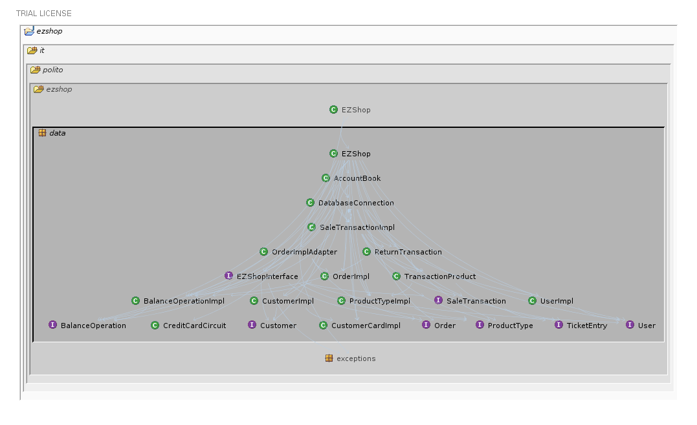
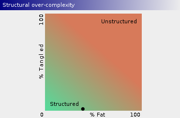
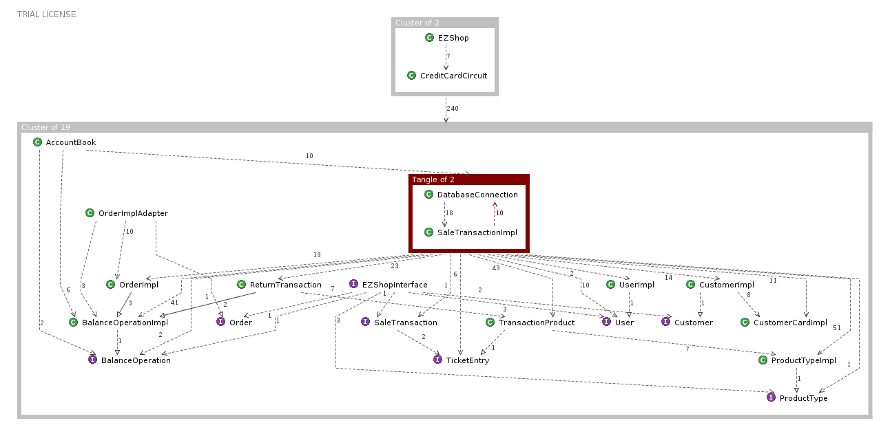

# Design assessment


```
<The goal of this document is to analyse the structure of your project, compare it with the design delivered
on April 30, discuss whether the design could be improved>
```

# Levelized structure map
```
<Applying Structure 101 to your project, version to be delivered on june 4, produce the Levelized structure map,
with all elements explosed, all dependencies, NO tangles; and report it here as a picture>
```

# Structural over complexity chart
```
<Applying Structure 101 to your project, version to be delivered on june 4, produce the structural over complexity chart; and report it here as a picture>
```



# Size metrics

```
<Report here the metrics about the size of your project, collected using Structure 101>
```


| Metric                                    | Measure |
| ----------------------------------------- | ------- |
| Packages                                  |   5      |
| Classes (outer)                           |    42     |
| Classes (all)                             |      42   |
| NI (number of bytecode instructions)      |      6971   |
| LOC (non comment non blank lines of code) |     2998    |


# Items with XS

```
<Report here information about code tangles and fat packages>
```

| Item | Tangled | Fat  | Size | XS   |
| ---- | ------- | ---- | ---- | ---- |
| ezshop.it.polito.ezshop.data.EZShop     |         |   177   |  2836    |   913   |


# Package level tangles

```
<Report screen captures of the package-level tangles by opening the items in the "composition perspective"
(double click on the tangle from the Views->Complexity page)>
```


# Summary analysis
```
<Discuss here main differences of the current structure of your project vs the design delivered on April 30>
<Discuss if the current structure shows weaknesses that should be fixed>
```
 There are no substantial structural differences between the current Design and the one delivered on April 30th.
 Apart from the addition, modification and removal of some methods in some classes (Return Transaction, Sale Transaction, Customer, Product Type), which occurred during the coding phase, the most relevant modification is the one made on the class once called "Singleton Database Connection" and now defined as "Database Connection", here all the necessary methods to make the data persistent in the system have been added.
 As the structural over complexity chart shows, the program appears to be well structured, in fact, as it can be seen from it, the percentage of tangled code is almost zero,as there are only two items with a cyclic dependency.
 The percentage of fat code, even if it can be improved, is still acceptable given the size and complexity of the code in question.
 

