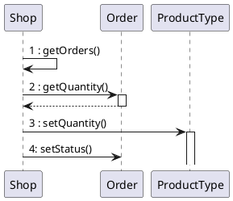
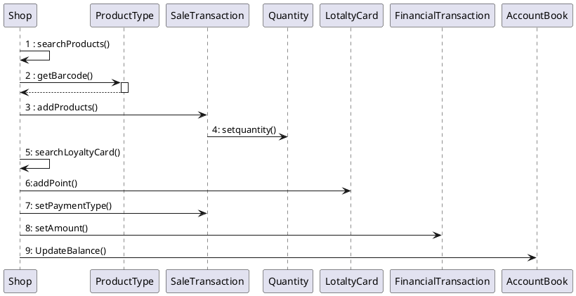
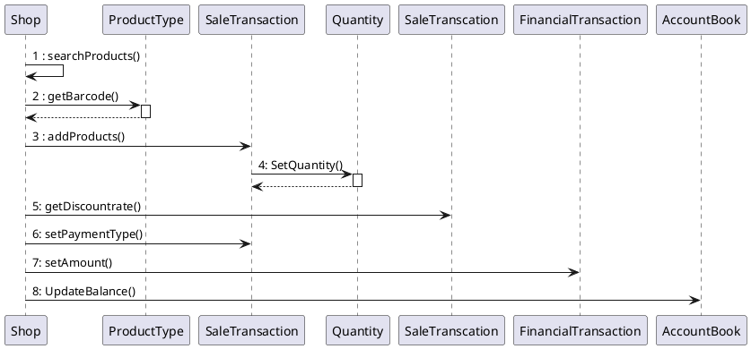

# Design Document 

Authors: 

Date:

Version:

# Contents

- [Design Document](#design-document)
- [Contents](#contents)
- [Instructions](#instructions)
- [High level design](#high-level-design)
- [Low level design](#low-level-design)
- [Verification traceability matrix](#verification-traceability-matrix)
- [Verification sequence diagrams](#verification-sequence-diagrams)
  - [Sequence diagram for scenario "RECORD ORDER PRODUCT"](#sequence-diagram-for-scenario-record-order-product)
  - [Sequence diagram for scenario "6.4"](#sequence-diagram-for-scenario-64)
  - [Sequence diagram for scenario "6.3"](#sequence-diagram-for-scenario-63)

# Instructions

The design must satisfy the Official Requirements document, notably functional and non functional requirements

# High level design 

<discuss architectural styles used, if any>
<report package diagram>

The style selected is single application (or app?). 
The system is organized according to the layered model: Presentation layer, Application logic and data layer,last one implemented by a DBMS to provide the persistence of the data.
It used the MVC pattern, with the V in the Presentation layer and the MC implemented in the others layers.
The others  patterns used are:
-Singleton Pattern: to handle the user's log in procedure
-Façade Pattern: to use the package without see all the details inside
-Observer Pattern: to handle the shift/changing of the data model
-Adapter Pattern:to handle different interfaces like for driver about ticket and barcode

Package:
- exception: this package contains all the classes that handle every kind of exception launched/thrown by the system.
-Controller: is responsible to handle events generated by the user's interaction with the GUI.
The controller layer interacts with the MODEL package and the logic package
-model: this package contains all the Model classes needed in the application; theese ones provide the model of the application, and represent all the data that the application must handle.
-logic: This package provides all the interfaces required to manage every model class in the system.

 

# Low level design

<for each package, report class diagram>

# Verification traceability matrix

\<for each functional requirement from the requirement document, list which classes concur to implement it>
|  | Position | Product Type| Quantity | Sale Transaction | Customer | Loyalty card| Return Transaction | Order        | Shop | Employee | Financial Transaction | Credit        | Debit   | Sale| Account Book |Product|
| :---: |:--------------:| :-------------:      | :---------: |:-------------:    | :-----:        | :-------------:      |:-------------:| :-------------: |:-------------:| :-------------: |:-------------:| :-------------: |:------------------:|:---:|:---:|:----:|
| FR1   || | || || ||X |X| || || | |
| FR3|X| X| ||X |X| || X|X| || || | |
| FR4 |X|X |X || || |X| X|X|X|| || | |
| FR5 || | ||X|X| ||X |X| || || | |
| FR6 ||X |X |X| X|X|X ||X |X|X || || | |
| FR7   || | || || ||X || X|| ||| |
| FR8   | || | || || |X| X|X| || | | |
|  | || | || || || || || | | |
|  | || | || || || || || | | |
|  | || | || || || || || | | |
|  | || | || || || || || | | |
|  | || | || || || || || | | |
|  | || | || || || || || | | |

# Verification sequence diagrams 
\<select key scenarios from the requirement document. For each of them define a sequence diagram showing that the scenario can be implemented by the classes and methods in the design>
## Sequence diagram for scenario "RECORD ORDER PRODUCT"

## Sequence diagram for scenario "6.4"

## Sequence diagram for scenario "6.3"
