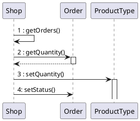
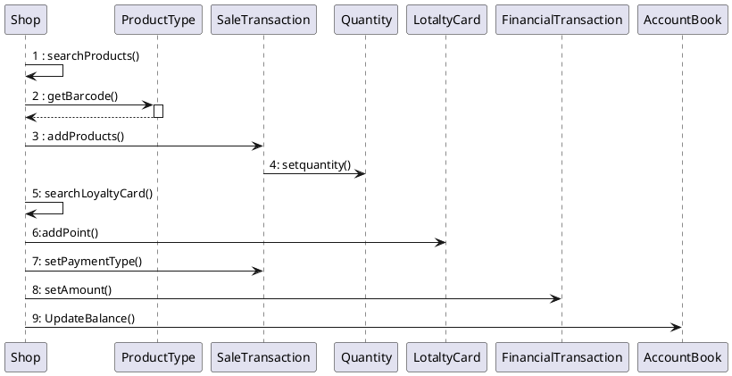
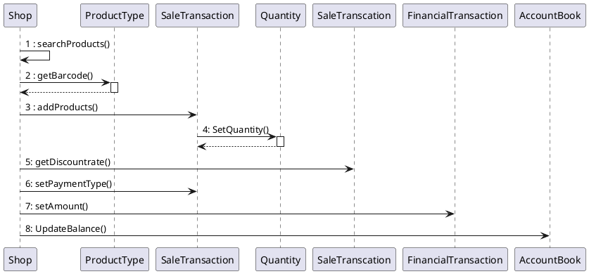

# Design Document 

Authors: 

Date:

Version:

# Contents

- [Design Document](#design-document)
- [Contents](#contents)
- [Instructions](#instructions)
- [High level design](#high-level-design)
- [Low level design](#low-level-design)
- [Verification traceability matrix](#verification-traceability-matrix)
- [Verification sequence diagrams](#verification-sequence-diagrams)
  - [Sequence diagram for scenario "RECORD ORDER PRODUCT"](#sequence-diagram-for-scenario-record-order-product)
  - [Sequence diagram for scenario "6.4"](#sequence-diagram-for-scenario-64)
  - [Sequence diagram for scenario "6.3"](#sequence-diagram-for-scenario-63)

# Instructions

The design must satisfy the Official Requirements document, notably functional and non functional requirements

# High level design 

<discuss architectural styles used, if any>
<report package diagram>

The  Architecture style selected is single application.
The application is organized according to the 3-layered model: Presentation layer, Application logic and Data layer,last one implemented by a DBMS to provide the persistence of the data.
It used the MVC pattern, with the V in the Presentation layer and the MC implemented in the others layers.
The others  patterns used are:
- Singleton Pattern: to handle the database connection
- Façade Pattern: to use the packages without see all the details inside

Packages:
- it.polito.ezshop.exception: This package contains all the classes that handle every kind of exception thrown by the system.
- it.polito.ezshop.data: This package provides all the logic and the operation required to manage every model class in the application.
- it.polito.ezshop.model: This package contains all the Model classes needed in the application; these ones provide the model of the application, and represent all the data that the application must handle.

 

# Low level design

<for each package, report class diagram>

# Verification traceability matrix

\<for each functional requirement from the requirement document, list which classes concur to implement it>
| | Shop  | Payment| CashPayment| CreditCardPayment |  CreditCard| SaleTransaction |ReturnTransaction | TransactionProduct|ProductType| Customer |CustomerCard|Order    | User |  AccountBook |BalanceOperation|
| :---: |:--------------:| :-------------:      | :---------: |:-------------:    | :-----:        | :-------------:      |:-------------:| :-------------: |:-------------:| :-------------: |:-------------:| :-------------: |:------------------:|:---:|:---:|
| FR1   |X| | || || |||| || X|| | 
| FR1.1 |X| | || || || || ||X || | 
| FR1.2 |X| || || || |||| |X| | |
| FR1.3 |X| | |||| || || ||X || | 
| FR1.4 |X| | || || || || || X|| | 
| FR1.5 |X| | || || || || || X||| 
| FR3   |X || | || || |X| || |X| | | 
| FR3.1 | X|| | || || |X| || |X| | | 
| FR3.2 | X|| | || || |X| || |X| | | 
| FR3.3 |X || | || || || || |X| | | 
| FR3.4 |X || | || || |X| || |X| | | 
| FR4   | X|X|X | X|X| || |X| || X|X|X |X | 
| FR4.1 |X|| | || || |X| || |X| | | 
| FR4.2 |X || | || || |X| || |X| | | 
| FR4.3 |X || | || || || || |X| | | 
| FR4.4 |X |X|X |X |X| || || ||X |X|X |X | 
| FR4.5 |X |X|X |X |X| || || ||X |X|X | X| 
| FR4.6 | X|| | || || || || X|X| | | 
| FR4.7 |X || | || || || |||X| | | 
| FR5   | X|| | || || ||X |X| |X| | | 
| FR5.1 |X || | || || || X|| |X| | | 
| FR5.2 |X || | || || ||X || |X| | | 
| FR5.3 | X|| | || || ||X || |X| | | 
| FR5.4 | X|| | || || || || |X| | | 
| FR5.5 |X || | || || || |X| |X| | | 
| FR5.6 | X|| | || || ||X |X| |X| | | 
| FR5.7 |X || | || || || |X| |X| | | 
| FR6   |X |X|X |X |X|X |X|X || || |X| X|X | 
| FR6.1 | X|| | || || || || |X| | | 
| FR6.2 | X|| | ||X || || || |X| | | 
| FR6.3 |X || | ||X || || || |X| | | 
| FR6.4 |X || | ||X || || || |X|| | |
| FR6.5 |X || | ||X ||X || || |X|| | 
| FR6.6 |X || | ||X || || || |X| | | 
| FR6.7 | X|| | || || || || |X| | | 
| FR6.8 |X || | || || || || |X| | | 
| FR6.9 |X || | || || || || |X| | | 
| FR6.10| X|| | ||X || || || |X| | | 
| FR6.11| X|X|X |X |X|X || || || |X| X|X |
| FR6.12|X || | ||X || || || |X| | | 
| FR6.13| X|| | || || || || |X| | | 
| FR6.14| X|| | || |X| || || |X| | | 
| FR6.15| X|X| X| X|X| |X| || || |X|X | X| 
| FR7   |X |X|X | X|X| X|| || || |X|X |X |
| FR7.1 |X |X|X | ||X || || || |X| X|X |
| FR7.2 | X|X| |X |X|X || || || |X| X|X |
| FR7.3 |X |X|X | || |X| || || |X|X |X |
| FR7.4 | X|X| |X |X| |X| || || |X| X|X | 
| FR8   | X|| | || || || || |X| X| X| 
| FR8.1 | X|| | || || || || |X|X | X| 
| FR8.2 |X || | || || || || |X| X|X | 
| FR8.3 |X || | || || || || |X|X | X| 
| FR8.4 | X|| | || || || || |X| | |
| ||| | || || || || || | |  

# Verification sequence diagrams 
\<select key scenarios from the requirement document. For each of them define a sequence diagram showing that the scenario can be implemented by the classes and methods in the design>
## Sequence diagram for scenario "RECORD ORDER PRODUCT"

## Sequence diagram for scenario "6.4"

## Sequence diagram for scenario "6.3"
