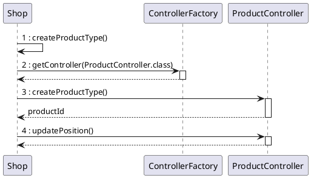
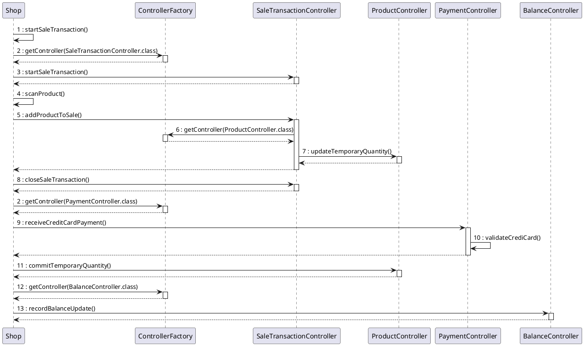

# Design Document


Authors:

Date:

Version:


# Contents

- [Design Document](#design-document)
- [Contents](#contents)
- [Instructions](#instructions)
- [High level design](#high-level-design)
- [Low level design](#low-level-design)
- [Verification traceability matrix](#verification-traceability-matrix)
- [Verification sequence diagrams](#verification-sequence-diagrams)
  - [Sequence diagram for scenario "RECORD ORDER PRODUCT"](#sequence-diagram-for-scenario-record-order-product)
  - [Sequence diagram for scenario "6.4"](#sequence-diagram-for-scenario-64)
  - [Sequence diagram for scenario "6.3"](#sequence-diagram-for-scenario-63)

# Instructions

The design must satisfy the Official Requirements document, notably functional and non functional requirements

# High level design

<discuss architectural styles used, if any>
<report package diagram>


# Low level design

- User(username, password, id)
  - Administrator, Cashier, ShopManager
- ProductType(id, description, barcode, pricePerUnit, note, Position position(optional))
- Product(id, quantity, temporaryQuantity, ProductType)
- Position(aisleNumber, rackAlphabeticIdentifier, levelNumber)
- Order(id, String productCode, int quantity, double pricePerUnit, supplier(?), status, arrival)
- Customer(id, name, CustomerCard cc)
- CustomerCard(id, points)
- SaleTransaction(id, list<TransactionProduct>, CustomerCard, points, Ticket)
- TransactionProduct(id, quantity, discount)
- Ticket(id, ReturnTransaction, Payment)
- AccountBook(List<FinancialTransaction>)
- FinancialTransaction
- Credit
- Debit
- ReturnTransaction(Ticket, list<Product, amount>, committed: true;false, Payment)
- Payment(id, )
  - CashPayment(cash, return)
  - CreditCardPayment(Credit card)
- Credit card ?
- BalanceOperation (Credit, Debit, Order, Sale, Return)
- EZShop(User logged, )


```plantuml
package Model
package Data
package Exception
package Database
package GUI

Data --> Model
Data --> Exception
Data --> Database
```

```plantuml

  left to right direction
package it.polito.ezshop.data {

    class DatabaseConnection {
      + dbUrl
    }
  class Shop {
    + loggedUser: User
    + List<User> allUsers
    + List<SaleTransaction> allSales
    + List<ProductType>
    + List<Product>
    + List<Order>
    + List<Customer>
    + List<CustomerCard>
    + AccountBook
    + reset()
+ Integer createUser(String username, String password, String role)
+ boolean deleteUser(Integer id)
+ List<User> getAllUsers()
+ User getUser(Integer id)
+ boolean updateUserRights(Integer id, String role)
+ User login(String username, String password)
+ boolean logout()
+ Integer createProductType(String description, String productCode, double pricePerUnit, String note)
+ String scanProduct()
+ boolean updateProduct(Integer id, String newDescription, String newCode, double newPrice, String newNote)
+ boolean deleteProductType(Integer id)
+ List<ProductType> getAllProductTypes()
+ ProductType getProductTypeByBarCode(String barCode)
+ List<ProductType> getProductTypesByDescription(String description)
+ boolean updateQuantity(Integer productId, int toBeAdded)
+ boolean updatePosition(Integer productId, String newPos)
+ Integer issueReorder(String productCode, int quantity, double pricePerUnit)
+ Integer payOrderFor(String productCode, int quantity, double pricePerUnit)
+ boolean payOrder(Integer orderId)
+ boolean recordOrderArrival(Integer orderId)
+ List<Order> getAllOrders()
+ Integer defineCustomer(String customerName)
+ boolean modifyCustomer(Integer id, String newCustomerName, String newCustomerCard)
+ boolean deleteCustomer(Integer id)
+ Customer getCustomer(Integer id)
+ List<Customer> getAllCustomers()
+ String createCard()
+ boolean attachCardToCustomer(String customerCard, Integer customerId)
+ boolean modifyPointsOnCard(String customerCard, int pointsToBeAdded)
+ Integer startSaleTransaction()
+ boolean addProductToSale(Integer transactionId, String productCode, int amount)
+ boolean deleteProductFromSale(Integer transactionId, String productCode, int amount)
+ boolean applyDiscountRateToProduct(Integer transactionId, String productCode, double discountRate)
+ boolean applyDiscountRateToSale(Integer transactionId, double discountRate)
+ int computePointsForSale(Integer transactionId)
+ boolean closeSaleTransaction(Integer transactionId)
+ boolean deleteSaleTicket(Integer ticketNumber)
+ Ticket getSaleTicket(Integer transactionId)
+ Ticket getTicketByNumber(Integer ticketNumber)
+ Integer startReturnTransaction(Integer ticketNumber)
+ boolean returnProduct(Integer returnId, String productCode, int amount)
+ boolean endReturnTransaction(Integer returnId, boolean commit)
+ boolean deleteReturnTransaction(Integer returnId)
+ double receiveCashPayment(Integer ticketNumber, double cash)
+ boolean receiveCreditCardPayment(Integer ticketNumber, String creditCard)
+ double returnCashPayment(Integer returnId)
+ double returnCreditCardPayment(Integer returnId, String creditCard)
+ boolean recordBalanceUpdate(double toBeAdded)
+ List<BalanceOperation> getCreditsAndDebits(LocalDate from, LocalDate to)
+ double computeBalance()
+ boolean loadFromDb()
  }
  Shop -[hidden]-> DatabaseConnection
  Shop --> DatabaseConnection
}

package it.polito.ezshop.model {
  interface FinancialTransaction
  interface Credit
  interface Debit
  interface Payment
  class User {
    + id
    + name
    + surname
    + username
    + password
    + role
    + updateUserRights(String role)
    - deleteFromDb()
  }
  class Product {
    + id
    + quantity
    + temporaryQuantity
    + ProductType
    + boolean updateQuantity(int toBeAdded)
    + boolean updateTemporaryQuantity(int toBeAdded)
    + boolean commitTemporaryQuantity()
  }

  class ProductType{
      + id
      + barcode
      + description
      + pricePerUnit
      + discountRate
      + position
      + note
      + boolean updateProduct(String newDescription, String newCode, double newPrice, String newNote)
      + boolean updatePosition(String newPos)
      - deleteFromDb()
  }
  class Order {
    + id
    + ProductType
    + supplier
    + pricePerUnit
    + quantity
    + status
    + arrival
    + Payment
    + Integer payOrder()
    + boolean recordOrderArrival()
  }
  class CustomerCard {
      + id
      + points
      + Customer
      + boolean modifyPointsOnCard(int pointsToBeAdded)
      - deleteFromDb()
  }
  class Customer {
      + id
      + name
      + boolean modifyCustomer(String newCustomerName, String newCustomerCard)
      - deleteFromDb()
  }
  class SaleTransaction {
      + id
      + discount
      + points
      + Optional<ReturnTransaction>
      + List<TransactionProduct>
      + boolean applyDiscountRateToSale(double discountRate)
      + status
      + Payment
      + Optional<CustomerCard>
      + boolean setCustomerCard(String customerCardId)
      + boolean addProductToSale(String productCode, int amount)
      + boolean deleteProductFromSale(String productCode, int amount)
      + boolean deleteProductFromSale(String productCode, int amount)
      + boolean applyDiscountRateToProduct(String productCode, double discountRate)
      + boolean applyDiscountRateToSale(double discountRate)
      + int computePointsForSale()
      + boolean closeSaleTransaction()
      + Integer startReturnTransaction()
      + boolean deleteReturnTransaction()
      + boolean linkCustomerCard()
      + boolean unlinkCustomerCard(String customerCardId)

  }
  class ReturnTransaction {
    + List<TransactionProduct>
    + committed
    + Payment
    + boolean returnProduct(String productCode, int amount)
    + boolean endReturnTransaction(boolean commit)
    + double receiveCashPayment(double cash)
    + boolean receiveCreditCardPayment(String creditCard)
    - deleteFromDb()
  }
  class TransactionProduct {
    + Product
    + amount
    + discountRate
    + boolean applyDiscountRateToProduct(double discountRate)
    - deleteFromDb()
  }
  class CashPayment {
    + cash
    + return
  }
  class CreditCardPayment {
    + CreditCard
    + boolean validateCrediCard(String creditCard)
	+ boolean pay(amount)
  }
  Class CreditCard {
    + code
    + boolean pay(amount)
  }
  class AccountBook{
    + balance
    + List<FinancialTransaction>
    + boolean recordBalanceUpdate(double toBeAdded)
    + List<BalanceOperation> getCreditsAndDebits(LocalDate from, LocalDate to)
    + double computeBalance()
  }


  Credit --|> FinancialTransaction
  Debit --|> FinancialTransaction
  SaleTransaction --|> Credit
  ReturnTransaction --|> Debit
  Order --|> Debit

  Payment <|-- CreditCardPayment
  Payment <|-- CashPayment

AccountBook --> FinancialTransaction

SaleTransaction --> Payment
SaleTransaction --> ReturnTransaction
ReturnTransaction --> Payment
CreditCardPayment -left-> CreditCard
SaleTransaction --> TransactionProduct
TransactionProduct --> Product
CustomerCard --> Customer
SaleTransaction --> CustomerCard

ProductType <-- Product
Order --> ProductType
ReturnTransaction --> TransactionProduct
}


  Shop -> User
  Shop -> SaleTransaction
  Shop -> ProductType
  Shop -> Product
  Shop -> Order
  Shop -> Customer
  Shop -> CustomerCard
  Shop -> AccountBook


Shop -left-> User

```
```plantuml
package it.polito.ezshop.exception {
class InvalidUsernameException
class InvalidPasswordException
class InvalidRoleException

class InvalidUserIdException
class UnauthorizedException

class InvalidProductDescriptionException
class InvalidProductCodeException
class InvalidPricePerUnitException
class InvalidProductIdException
class InvalidLocationException
class InvalidQuantityException

class InvalidOrderIdException
class InvalidCustomerNameException
class InvalidCustomerIdException
class InvalidCustomerCardException

class InvalidDiscountRateException
class InvalidTransactionIdException
class InvalidTicketNumberException

class InvalidCreditCardException
}
```
Due to some GitLab limitation the entire Class Diagram can't be properly rendered, you can see the exported result [here](image/class-diagram.png).
In order to make the Class Diagram more clear, the get and set methods have been committed from the diagram. For the same reason, the links from each class of the controller package to each classes of the model package have been omitted. The relation is 1:1 since the each calls of the controller internally works with the data representation given by the model.


# Verification traceability matrix

|  | Position | Product Type| Quantity | Sale Transaction | Customer | Loyalty card| Return Transaction | Order        | Shop | User | Financial Transaction | Credit        | Debit   | Sale| Account Book |Product|
| :---: |:--------------:| :-------------:      | :---------: |:-------------:    | :-----:        | :-------------:      |:-------------:| :-------------: |:-------------:| :-------------: |:-------------:| :-------------: |:------------------:|:---:|:---:|:----:|
| FR1   || | || || ||X |X| || || | |
| FR3|X| X| ||X |X| || X|X| || || | |
| FR4 |X|X |X || || |X| X|X|X|| || | |
| FR5 || | ||X|X| ||X |X| || || | |
| FR6 ||X |X |X| X|X|X ||X |X|X || || | |
| FR7   || | || || ||X || X|| ||| |
| FR8   | || | || || |X| X|X| || | | |
|  | || | || || || || || | | |
|  | || | || || || || || | | |
|  | || | || || || || || | | |
|  | || | || || || || || | | |
|  | || | || || || || || | | |
|  | || | || || || || || | | |


# Verification sequence diagrams
\<select key scenarios from the requirement document. For each of them define a sequence diagram showing that the scenario can be implemented by the classes and methods in the design>


## Sequence diagram for scenario 1.1


## Sequence diagram for scenario 6.1

