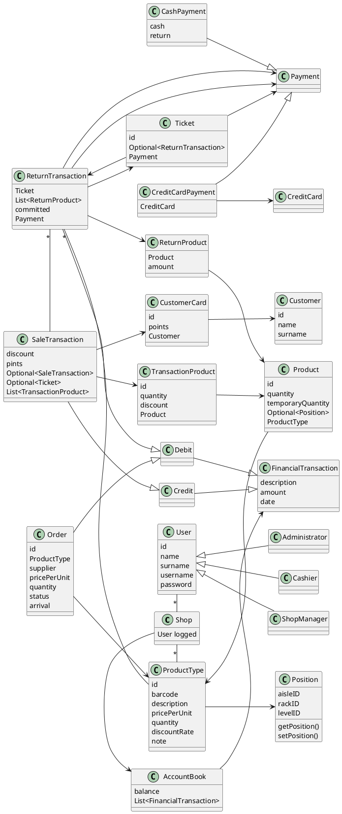
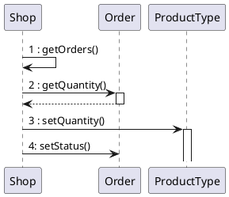
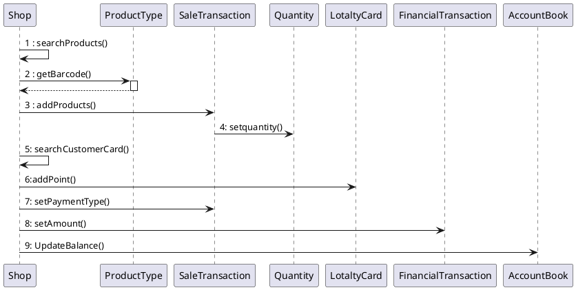
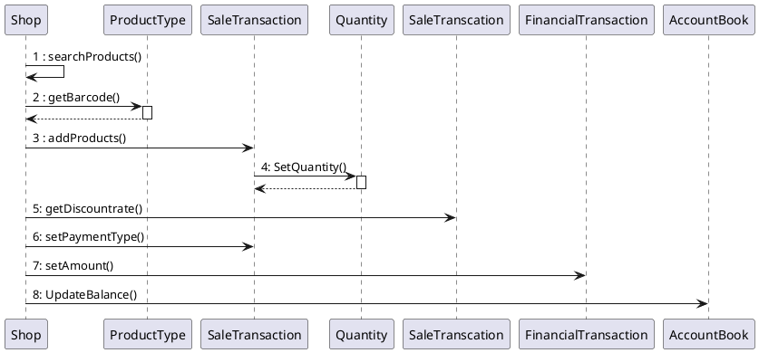

# Design Document


Authors:

Date:

Version:


# Contents

- [Design Document](#design-document)
- [Contents](#contents)
- [Instructions](#instructions)
- [High level design](#high-level-design)
- [Low level design](#low-level-design)
- [Verification traceability matrix](#verification-traceability-matrix)
- [Verification sequence diagrams](#verification-sequence-diagrams)
  - [Sequence diagram for scenario "RECORD ORDER PRODUCT"](#sequence-diagram-for-scenario-record-order-product)
  - [Sequence diagram for scenario "6.4"](#sequence-diagram-for-scenario-64)
  - [Sequence diagram for scenario "6.3"](#sequence-diagram-for-scenario-63)

# Instructions

The design must satisfy the Official Requirements document, notably functional and non functional requirements

# High level design

<discuss architectural styles used, if any>
<report package diagram>


# Low level design
## Package
#### Exception
InvalidRoleException
InvalidPasswordException
InvalidProductDescriptionException
InvalidPricePerUnitException
InvalidLocationException
InvalidCustomerIdException
InvalidCustomerCardException
InvalidDiscountRateException
InvalidProductCodeException
InvalidQuantityException
InvalidPaymentException
InvalidCreditCardException
UnauthorizedException

#### Model

- User(username, password, id)
  - Administrator, Cashier, ShopManager
- ProductType(id, description, barcode, pricePerUnit, note, Position position(optional))
- Product(id, quantity, temporaryQuantity, ProductType)
- Position(aisleNumber, rackAlphabeticIdentifier, levelNumber)
- Order(id, String productCode, int quantity, double pricePerUnit, supplier(?), status, arrival)
- Customer(id, name, CustomerCard cc)
- CustomerCard(id, points)
- SaleTransaction(id, list<TransactionProduct>, CustomerCard, points, Ticket)
- TransactionProduct(id, quantity, discount)
- Ticket(id, ReturnTransaction, Payment)
- AccountBook(List<FinancialTransaction>)
- FinancialTransaction
- Credit
- Debit
- ReturnTransaction(Ticket, list<Product, amount>, committed: true;false, Payment)
- Payment(id, )
  - CashPayment(cash, return)
  - CreditCardPayment(Credit card)
- Credit card ?
- BalanceOperation (Credit, Debit, Order, Sale, Return)
- EZShop(User logged, )


```plantuml
package Controller
package Model
package Data
package Exception
package GUI

Controller --> Model
Controller --> Data
Controller --> Exception
```

```plantuml
class Shop {
  loggedUser
}

package it.polito.ezshop.model {
  interface FinancialTransaction
  interface Credit
  interface Debit
  interface Payment
  class User {
    id
    name
    surname
    username
    password
    type
  }
  class Product {
    id
    quantity
    temporaryQuantity
    position
    ProductType
  }
  class ProductType{
      id
      barcode
      description
      pricePerUnit
      discountRate
      note
      List<Product>
  }
  class Order {
    id
    ProductType
    supplier
    pricePerUnit
    quantity
    status
    arrival
  }
  class CustomerCard {
      id
      points
      Customer
  }
  class Customer {
      id
      name
      surname
  }
  class SaleTransaction {
      discount
      pints
      Optional<Ticket>
      List<TransactionProduct>
  }
  class ReturnTransaction {
    Ticket
    List<TransactionProduct>
    committed
    Payment
  }
  class TransactionProduct {
    Product
    amount
  }
  class CashPayment {
    cash
    return
  }
  class CreditCardPayment {
    CreditCard
  }
  class AccountBook{
    balance
    List<FinancialTransaction>
  }
  class Ticket{
    id
    Optional<ReturnTransaction>
    Payment
  }

  Credit -up-|> FinancialTransaction
  Debit -up-|> FinancialTransaction
  SaleTransaction -up-|> Credit
  ReturnTransaction -up-|> Debit
  Order -up-|> Debit

  Payment <|-- CreditCardPayment
  Payment <|-- CashPayment

AccountBook -left-> FinancialTransaction

Ticket --> Payment
ReturnTransaction --> Payment
CreditCardPayment --> CreditCard
SaleTransaction --> TransactionProduct
TransactionProduct --> Product
CustomerCard --> Customer
SaleTransaction --> CustomerCard

ProductType --> Product
Order --> ProductType
SaleTransaction --> Ticket
ReturnTransaction --> TransactionProduct
}

package it.polito.ezshop.controller {
  class UserController
  class ProductController
  class OrderController
  class CustomerController
  class SaleTransactionController
  class ReturnTransactionController
  class PaymentController
}

UserController --> User
ProductController --> Product
ProductController --> ProductType
OrderController --> Order
CustomerController --> Customer
CustomerController --> CustomerCard
SaleTransactionController ---> Ticket
SaleTransactionController ---> TransactionProduct
SaleTransactionController ---> SaleTransaction
ReturnTransactionController --> ReturnTransaction
ReturnTransactionController --> TransactionProduct
PaymentController --> CreditCardPayment
PaymentController --> CashPayment


package it.polito.ezshop.exception {
  class InvalidRoleException
  class InvalidPasswordException
  class InvalidProductDescriptionException
  class InvalidPricePerUnitException
  class InvalidLocationException
  class InvalidCustomerIdException
  class InvalidCustomerCardException
  class InvalidDiscountRateException
  class InvalidProductCodeException
  class InvalidQuantityException
  class InvalidPaymentException
  class InvalidCreditCardException
  class UnauthorizedException
}

package it.polito.ezshop.GUI {
}


package it.polito.ezshop.data {
  class UserPersistance
  class ProductPersistance
  class ProductTypePersistance
  class OrderPersistance
  class CustomerPersistance
  class CustomerCardPersistance
  class SaleTransactionPersistance
  class SaleProductPersistance
  class ReturnTransactionPersistance
  class TransactionProductPersistance
  class CashPaymentPersistance
  class CreditCardPaymentPersistance
  class TicketPersistance
}


UserController --> UserPersistance
ProductController --> ProductPersistance
ProductController --> ProductTypePersistance
OrderController --> OrderPersistance
CustomerController --> CustomerPersistance
CustomerController --> CustomerCardPersistance
SaleTransactionController ---> TicketPersistance
SaleTransactionController ---> TransactionProductPersistance
SaleTransactionController ---> SaleTransactionPersistance
ReturnTransactionController --> ReturnTransactionPersistance
ReturnTransactionController --> TransactionProductPersistance
PaymentController --> CreditCardPaymentPersistance
PaymentController --> CashPaymentPersistance

```





# Verification traceability matrix

\<for each functional requirement from the requirement document, list which classes concur to implement it>
|  | Position | Product Type| Quantity | Sale Transaction | Customer | Loyalty card| Return Transaction | Order        | Shop | User | Financial Transaction | Credit        | Debit   | Sale| Account Book |Product|
| :---: |:--------------:| :-------------:      | :---------: |:-------------:    | :-----:        | :-------------:      |:-------------:| :-------------: |:-------------:| :-------------: |:-------------:| :-------------: |:------------------:|:---:|:---:|:----:|
| FR1   || | || || ||X |X| || || | |
| FR3|X| X| ||X |X| || X|X| || || | |
| FR4 |X|X |X || || |X| X|X|X|| || | |
| FR5 || | ||X|X| ||X |X| || || | |
| FR6 ||X |X |X| X|X|X ||X |X|X || || | |
| FR7   || | || || ||X || X|| ||| |
| FR8   | || | || || |X| X|X| || | | |
|  | || | || || || || || | | |
|  | || | || || || || || | | |
|  | || | || || || || || | | |
|  | || | || || || || || | | |
|  | || | || || || || || | | |
|  | || | || || || || || | | |


# Verification sequence diagrams
\<select key scenarios from the requirement document. For each of them define a sequence diagram showing that the scenario can be implemented by the classes and methods in the design>
## Sequence diagram for scenario "RECORD ORDER PRODUCT"


## Sequence diagram for scenario "6.4"


## Sequence diagram for scenario "6.3"

