# Design Document


Authors: Battilana Matteo, Huang Chunbiao, Mondal Subhajit, Sabatini Claudia

Date: 16/05/2021

Version: 1.1


# Contents

- [Design Document](#design-document)
- [Contents](#contents)
- [Instructions](#instructions)
- [High level design](#high-level-design)
- [Low level design](#low-level-design)
- [Verification traceability matrix](#verification-traceability-matrix)
- [Verification sequence diagrams](#verification-sequence-diagrams)
  - [Sequence diagram for scenario 1.1](#sequence-diagram-for-scenario-11)
  - [Sequence diagram for scenario 2.1](#sequence-diagram-for-scenario-21)
  - [Sequence diagram for scenario 2.3](#sequence-diagram-for-scenario-23)
  - [Sequence diagram for scenario 3.1](#sequence-diagram-for-scenario-31)
  - [Sequence diagram for scenario 3.2](#sequence-diagram-for-scenario-32)
  - [Sequence diagram for scenario 3.3](#sequence-diagram-for-scenario-33)
  - [Sequence diagram for scenario 4.1](#sequence-diagram-for-scenario-41)
  - [Sequence diagram for scenario 4.3](#sequence-diagram-for-scenario-43)
  - [Sequence diagram for scenario 6.1 - scenario 7.4](#sequence-diagram-for-scenario-61---scenario-74)
  - [Sequence diagram for scenario 8.1 - scenario 7.4](#sequence-diagram-for-scenario-81---scenario-74)
  - [Sequence diagram for scenario 9.1](#sequence-diagram-for-scenario-91)


# Instructions

The design must satisfy the Official Requirements document, notably functional and non functional requirements

# High level design

```plantuml
package it.polito.ezshop.model
package it.polito.ezshop.data
package it.polito.ezshop.exception
package it.polito.ezshop.gui

it.polito.ezshop.data --> it.polito.ezshop.model
it.polito.ezshop.data --> it.polito.ezshop.exception
```

The  Architecture style selected is single application.
The application is organized accordingly to the 3-layered model: Presentation layer, Application logic and Data layer, the last one implemented with an Embedded Database to provide the persistence of the data.
This solution used the MVC pattern, with the V in the Presentation layer and the MC implemented in the others layers.
The others  patterns used are:
- Singleton Pattern: to handle the database connection
- Façade Pattern: to use the packages without see all the details inside

Packages:
- it.polito.ezshop.exception: This package contains all the classes that handle every kind of exception thrown by the system.
- it.polito.ezshop.data: This package provides all the logic and the operation required to manage every model class in the application.
- it.polito.ezshop.model: This package contains all the Model classes needed in the application; these ones provide the model of the application, and represent all the data that the application must handle.


# Low level design


```plantuml

 
left to right direction
package it.polito.ezshop.data {

    class DatabaseConnection {
      - databaseFileName: String
      - executeSqlScript(): Connection
      - createUser(user: User): Boolean
      + setUserRole(user: User, role: String): Boolean
      + deleteUser(user: User): Boolean
      + getAllUsers(): List<User>
      + createOrder(Order order): Boolean
      + getAllProducts(): List<ProductType>
      + updateProductType(prod: ProductType): Boolean
     - updateProduct(pt: ProductType, product: Product): Boolean
      + createProductType(prod: ProductType): Boolean
      + deleteAllProduct(product: ProductType): Boolean
      + deleteProductType(prod: ProductType): Boolean
      + createSaleTransaction(sale: SaleTransaction): Boolean
      + getAllSaleTransaction(): List<SaleTransaction>
      + getAllBySaleId(id: Integer): SaleTransaction
      - getAllRFID(saleTransactionId: Integer, id_product:Integer) : Map<String, Product>
      + getAllReturnTransaction(): List<ReturnTransaction>
      -getAllReturnProducts( balanceId: Integer, productid: Integer): Map<String, Product> 
      + addProductToSale(sale: SaleTransaction, ticket: TicketEntry, productId: Integer): Boolean
      + saveSaleTransaction(sale: SaleTransaction): Boolean
      + deleteSaleTransaction(sale: SaleTransaction): Boolean
      + updateSaleTransaction(sale: SaleTransaction): Boolean
      + saveBalanceOperation(op: BalanceOperation): Boolean
      + getAllBalanceOperations(): List<BalanceOperation>
      + deleteBalanceOperation(op: BalanceOperation): Boolean
      + saveReturnTransaction(returnT: ReturnTransaction): Boolean
      - saveRFIDReturn( balanceId: Integer, productId: Integer, products:List<Product>)
      + setStatusReturnTransaction(retT: ReturnTransaction): Boolean
      + updateOrder(o: Order): Boolean
      + getAllOrders(): List<Order>
      + deleteOrder(o: Order): Boolean
      + createCustomer(c: Customer): Boolean
      + updateCustomer(c: Customer): Boolean
      + getAllCustomers(): List<Customer>
      + getAllCustomerCards(): List<CustomerCard>
      + deleteCustomer(c: Customer): Boolean
      + createCustomerCard(c: CustomerCard): Boolean
      + updateCustomerCard(c: CustomerCard): Boolean
      + deleteReturnTransaction(retT: ReturnTransaction): Boolean
      + deleteAllTransactionProducts(): Boolean
      + updateBalance(balance: Double): Boolean
      + deleteBalance(): Boolean
      + getBalance(): Double
      + setAutoCommit(state:boolean)
      + closeConnection()
      + deleteCustomerCard(card: CustomerCard)
      + getLastRIFD(): Integer
      + updateLastRIFD(lastRFID:Integer)
      + removeLastRFID()

    }
  class CreditCardCircuit {
    + validateCreditCart(creditCardId: String): Boolean
    + pay(creditCardId: String, amount: Double): Boolean
    + isValid(creditCardId: String): Boolean
  }
  class Shop {
    - allUsers: Map<Integer, User>
    - allSales: Map<Integer, SaleTransaction>
    - products: Map<Integer, ProductType>
    - orders: Map<Integer, Order>
    - customers: Map<Integer, Customer>
    - customerCards: Map<String, CustomerCard>
    + reset(): Boolean
+ createUser(username: String, password: String, role: String): Integer
+ deleteUser(id: Integer): Boolean
+ getAllUsers(): List<User>
+ getUser(id: Integer): User
+ updateUserRights(id: Integer, role: String): Boolean
+ login(username: String, password: String): User
+ logout(): Boolean
+ createProductType(description: String, productCode: String, pricePerUnit: Double, note: String): Integer
+ updateProduct(id: Integer, newDescription: String, newCode: String, newPrice: Double, newNote: String): Boolean
+ deleteProductType(id: Integer): Boolean
+ getAllProductTypes(): List<ProductType>
+ getProductTypeByBarCode(barCode: String): ProductType
+getProductTypesByDescription(description: String): List<ProductType>
+ updateQuantity(productId: Integer, toBeAdded: Integer): Boolean
+ updatePosition(productId: Integer, newPos: String): Boolean
+ issueOrder(productCode: String, quantity: Integer, pricePerUnit: Double): Integer
+ payOrderFor(productCode: String, quantity: Integer, pricePerUnit: Double): Integer
+ payOrder(orderId: Integer): Boolean
+ recordOrderArrival(orderId: Integer): Boolean
+ recordOrderArrivalRFID(orderId: Integer,  RFIDfrom:String): Boolean
+ getAllOrders(): List<Order>
+ defineCustomer(customerName: String): Integer
+ modifyCustomer(id: Integer, newCustomerName: String, newCustomerCard: String): Boolean
+ deleteCustomer(id: Integer): Boolean
+ getCustomer(id: Integer): Customer
+ getAllCustomers(): List<Customer>
+ createCard(): String
+ attachCardToCustomer(customerCard: String, customerId: Integer): Boolean
+ modifyPointsOnCard(customerCard: String, pointsToBeAdded: Integer): Boolean
+ startSaleTransaction(): Integer
+ addProductToSale(transactionId: Integer, productCode: String, amount: Integer): Boolean
+ addProductToSaleRFID(transactionId: Integer, RFID: String): Boolean
+ deleteProductFromSale(transactionId: Integer, productCode: String, amount: Integer): Boolean
+ deleteProductFromSaleRFID(transactionId: Integer, RFID: String): Boolean
+applyDiscountRateToProduct(transactionId: Integer, productCode: String, discountRate: Double): Boolean
+ applyDiscountRateToSale(transactionId: Integer, discountRate: Double): Boolean
+ computePointsForSale(transactionId: Integer): Integer
+ endSaleTransaction(transactionId: Integer): Boolean
+ deleteSaleTransaction(transactionID: Integer): Boolean
+ getSaleTransaction(transactionId: Integer): SaleTransaction
+ startReturnTransaction(transactionID: Integer): Integer
+ returnProduct(returnId: Integer, productCode: String, amount: Integer): Boolean
+ returnProductRFID(returnId: Integer, RFID: String): Boolean
+ endReturnTransaction(returnId: Integer, Boolean commit): Boolean
+ deleteReturnTransaction(returnId: Integer): Boolean
+ receiveCashPayment(transactionID: Integer, cash: Double): Double
+ receiveCreditCardPayment(transactionID: Integer, creditCard: String): Boolean
+ returnCashPayment(returnId: Integer): Double
+ returnCreditCardPayment(returnId: Integer, creditCard: String): Double
+ recordBalanceUpdate(toBeAdded: Double): Boolean
+ getCreditsAndDebits(LocalDate from, LocalDate to): List<BalanceOperation>
+ computeBalance(): Double
- getProductByBarcode(barcode: String): ProductType
- getSaleTransactionByReturnTransactionId(id: Integer): SaleTransaction
- loadFromDb(): Boolean
  }
  Shop -[hidden]-> DatabaseConnection

    Shop -- CreditCardCircuit
    Shop -[hidden]-> CreditCardCircuit
}

package it.polito.ezshop.model {

  note "All classes in the model package\nare persistent" as N1
  class BalanceOperation {
    - id: integer
    - amount: Dobule
    - status: String
    - date: LocalDate
    - type: String
    + setStatus(status:String)
    + getStatus():String

  }
  class User {
    - id: Integer
    - name: String
    - surname: String
    - username: String
    - password: String
    - role: String
    + updateUserRights(role: String)
  }

  class ProductType{
      - id: Integer
      - barcode: String
      - description: String
      - pricePerUnit: Double
      - discountRate: Double
      - position: String
      - note: String
      - quantity: Integer
      + setTemporaryQuantity(quantity: Integer): Boolean
      + getAllProducts():List<Product>
      + setPosition(location:String)
      + addProduct(RFID:String)
      + removeByRFID(rfid:String)

  
  }
  class Order {
    - id: Integer
    - supplier: String
    - pricePerUnit: Double
    - quantity: Integer
    - status: String
    - arrival: LocalDate
    + recordOrderArrival()  
  }
  class CustomerCard {
      - id: String
      - points: Integer
      + setCustomer(customer: Customer)
      + removeCustomer()
      + modifyPointsOnCard(pointsToBeAdded: Integer): Boolean
  }
  class Customer {
      - id: Integer
      - name: String
      + removeCard()
  }
  class SaleTransaction {
      - id: Integer
      - discount: Dobule
      - points: Integer
      - returnTransactions: Map<Integer, ReturnTransaction>
      - prodList: Map<ProductType, TransactionProduct>
      - status: String
      + addProductToSale(product: ProductType, amount: Integer): Boolean
      + deleteProductFromSale(product: String, p: Product): Boolean
      + deleteProductFromSale(product: String, amount: Integer): Boolean
      + applyDiscountRateToProduct(product: ProductType, discountRate: Double): Boolean
      + applyDiscountRateToSale(discountRate: Double): Boolean
      + computePointsForSale(): Integer
      + endSaleTransaction(): Boolean
      + startReturnTransaction(): ReturnTransaction
      + getSoldQuantity(product: ProductType): Integer
      + computeTotal(): Double
      + endReturnTransaction(id: Integer, Boolean commit): Boolean
      + deleteReturnTransaction(id: Integer): Boolean
      + setReturnProduct(returnId: Integer, product: ProductType, amount: Integer): Boolean
      + getReturnTransactionStatus(id: Integer): Boolean
      + getReturnTransactionTotal(id: Integer): Boolean
      + setPaidReturnTransaction(id: Integer): Boolean
      + getReturnTransaction(id: Integer): ReturnTransaction
      + getReturnTransactions(): List<ReturnTransaction>
      + commitAllTemporaryQuantity()
      - getProductType(RFID:String): ProductTypeImpl 
      - getProduct(RFID:String): Product 
      + hasBeenSold(RFID:String): Boolean
      + reset()
  }
  class ReturnTransaction {
    - id: Integer
    - quantity: Integer
    - committed: String
    - status: Boolean
    + addProduct(prod:TransactionProduct, amount: Integer): Boolean
        + addProductprod:TransactionProduct, p: Product): Boolean
    + getReturns(): Map<TransactionProduct, Integer>
    + getAllReturns(): Map<TransactionProduct, List<Product>>
    + computeTotal(): Double
  }
  class TransactionProduct {
    - quantity: Integer
    - discount: Double
    - pricePerUnit: Double
    + applyDiscountRateToProduct(discountRate: Double): Boolean
    + getProductType():ProductType
    + addProduct(product:Product) 
    + removeProduct(product:Product)
    + containsProduct(String:RFID)


  }

  class AccountBook{
    - balance: Double
    - opList: List<BalanceOperation>
    + recordBalanceUpdate(toBeAdded: Double): Boolean
    + add(BalanceOperation): Boolean
    + getCreditsAndDebits(LocalDate from, LocalDate to): List<BalanceOperation>
    + computeBalance(): Double
    + reset()
    + loadFromFromDb(sales:Map<Integer, SaleTransaction> )
  }
class Product {
    - RFID: String
   
  }

  ReturnTransaction --|> BalanceOperation
  SaleTransaction --|> BalanceOperation
  Order -up-|> BalanceOperation

AccountBook --"*" BalanceOperation

SaleTransaction -right-"*" ReturnTransaction
SaleTransaction --"*" TransactionProduct
TransactionProduct "*" -- ProductType
CustomerCard "0..1"-- Customer
SaleTransaction -- "0..1" CustomerCard
ProductType--"*"Product 

Order -right- ProductType
ReturnTransaction -- ProductType
}

  Shop - "*" User
  Shop - "*" SaleTransaction
  Shop - "*" ProductType
  Shop - "*" Order
  Shop - "*" Customer
  Shop - "*" CustomerCard
  Shop - AccountBook


```


# Verification traceability matrix

| | Shop  | CreditCardCircuit |  SaleTransaction |ReturnTransaction | TransactionProduct|ProductType| Customer |CustomerCard|Order    | User |  AccountBook |
| :---: |:--------------:| :-------------:      | :---------: |:-------------:    | :-----:        | :-------------:      |:-------------:| :-------------: |:-------------:| :-------------: |:-------------:|
| FR1   |X|  || |||| || X||
| FR3   |X || || |X| || |X| |
| FR4   | X|| || |X| || X|X|X |
| FR5   | X||  || ||X |X| |X| |
| FR6   |X |X|X |X|X || |X| |X| X|
| FR7   |X |X| || || || |X|X |
| FR8   | X|| || || || |X| X|


# Verification sequence diagrams

## Sequence diagram for scenario 1.1
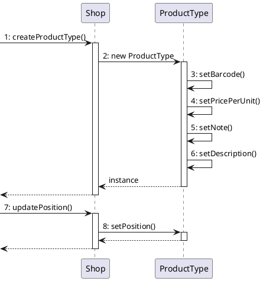


## Sequence diagram for scenario 2.1
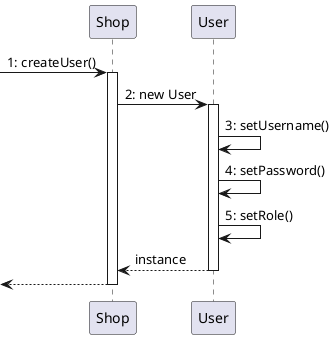

## Sequence diagram for scenario 2.3
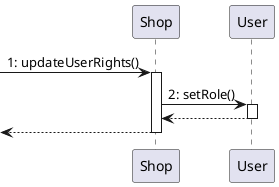

## Sequence diagram for scenario 3.1
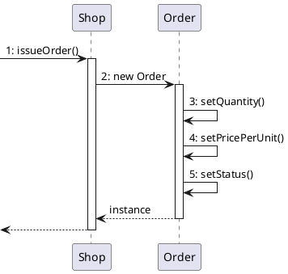

## Sequence diagram for scenario 3.2
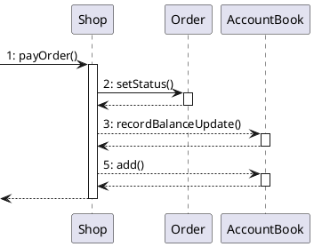

## Sequence diagram for scenario 3.3
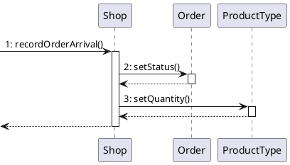


## Sequence diagram for scenario 4.1
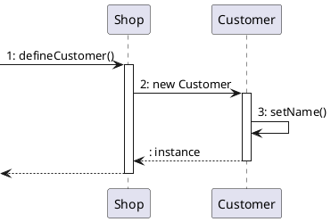

## Sequence diagram for scenario 4.3
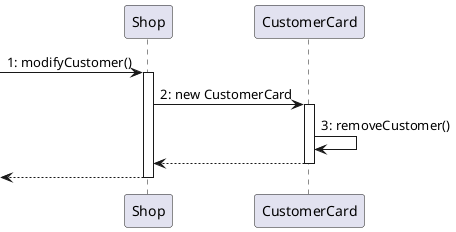


## Sequence diagram for scenario 6.1 - scenario 7.4
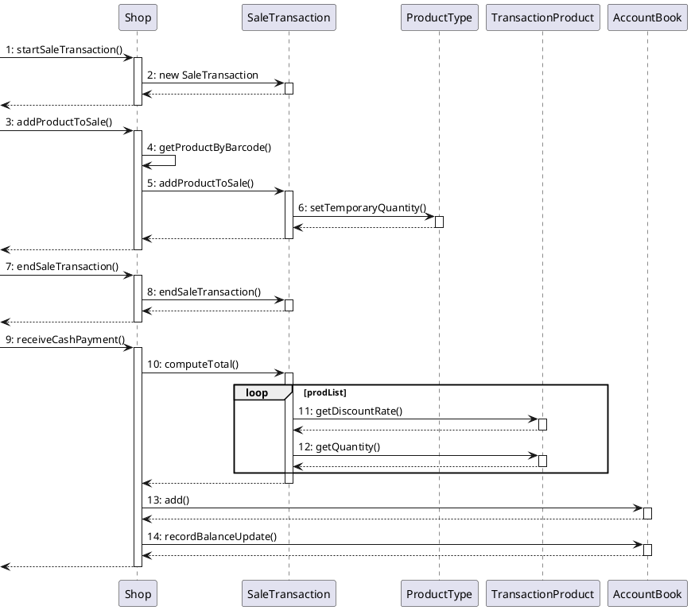

## Sequence diagram for scenario 8.1 - scenario 7.4
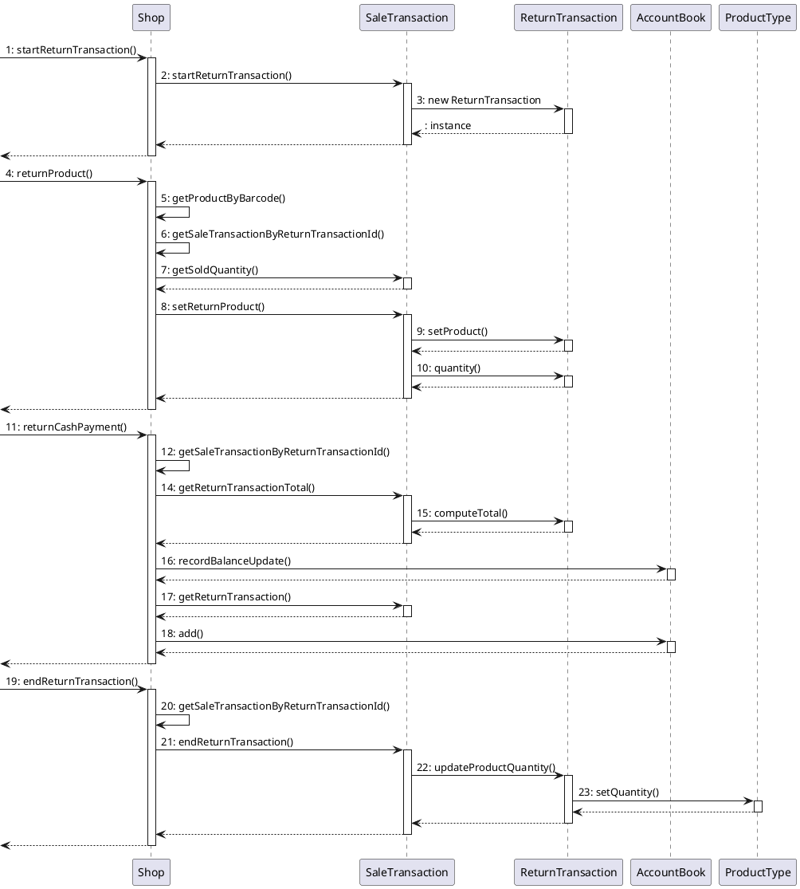


## Sequence diagram for scenario 9.1
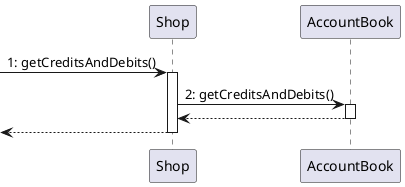
