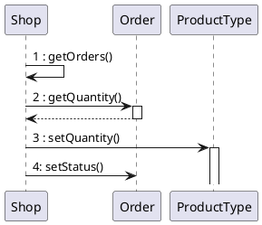
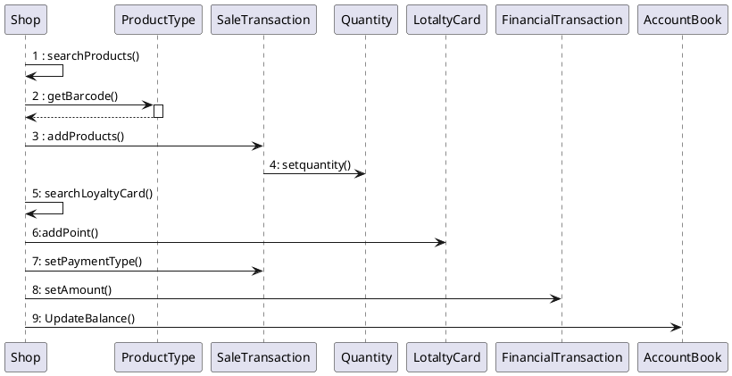
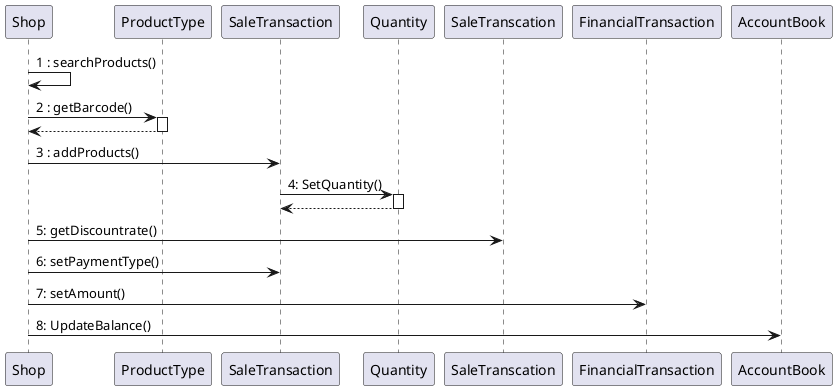

# Design Document 


Authors: 

Date:

Version:


# Contents

- [Design Document](#design-document)
- [Contents](#contents)
- [Instructions](#instructions)
- [High level design](#high-level-design)
- [Low level design](#low-level-design)
- [Verification traceability matrix](#verification-traceability-matrix)
- [Verification sequence diagrams](#verification-sequence-diagrams)
  - [Sequence diagram for scenario "RECORD ORDER PRODUCT"](#sequence-diagram-for-scenario-record-order-product)
  - [Sequence diagram for scenario "6.4"](#sequence-diagram-for-scenario-64)
  - [Sequence diagram for scenario "6.3"](#sequence-diagram-for-scenario-63)

# Instructions

The design must satisfy the Official Requirements document, notably functional and non functional requirements

# High level design 

<discuss architectural styles used, if any>
<report package diagram>


# Low level design

<for each package, report class diagram>

@startuml
```plantuml
left to right direction
class Employee {
 id
name
surname
AccessRight
getPersonalAccount()
}

class Shop{
getEmployeeName?()
getEmployeeSurname?()
SearchEmployee()
UpdateEmployee()
CreateEmployee()
getEmployeeId?()
getEmployeeAccessRight()
getEmployees()
deleteEmployee?()
getProducts()
UpdateProducts()
SearchProduct()
createProductType()
getOrders()
manageOrder()
createCustomer()
SearchCustomer()
modifyCustomer()
createFidelityCard()
deleteFidelityCrad?()
addPointFidelityCard()
searchTransaction()
ProduceReportTransaction()
showTranscationList()
getBalance()
updateBalance()


}
Shop -"*" Employee
class AccountBook {
    balance
}
AccountBook - Shop
class FinancialTransaction {
 description
 amount
 date
getAmount()
setDate()
getDescription()
setDescription()
}
AccountBook -- "*" FinancialTransaction

class Credit 
class Debit

Credit --|> FinancialTransaction
Debit --|> FinancialTransaction

class Order
class Sale
class Return

Order --|> Debit
Sale --|> Credit
Return --|> Debit


class ProductType{
    barCode
    description
    sellPrice
    quantity
    discountRate
    notes
getBarcode()
setBarcode()
getQuantity()
setQuantity()
getDescription()
setDescription()
setSellPrice()
getSellPrice()
}

Shop - "*" ProductType

class SaleTransaction {
    ID 
    date
    time
    cost
    paymentType
    discount rate
getId()
setId()
getdate()
setDate()
getTime()
setTime()
getcost()
setCost()
getPaymentType()
setPaymentType()
getDiscountRate()
setDiscountRate()
getProducts()
addProducts()
}
SaleTransaction - "*" ProductType

class Quantity {
    quantity
getQuantity()
setQuantity()
}
(SaleTransaction, ProductType)  .. Quantity

class LoyaltyCard {
    ID
    points
getId()
setId()
getPoint()
setPoint()
}

class Customer {
    name
    surname
getPersonalAccount()
setPersonalAccount()
}

LoyaltyCard "0..1" - Customer

SaleTransaction "*" -- "0..1" LoyaltyCard

class Product {
    
}

class Position {
    aisleID
    rackID
    levelID
getPosition()
setPosition()
}

ProductType - "0..1" Position

ProductType -- "*" Product : describes

class Order {
  supplier
  pricePerUnit
  quantity
  status
getQuantity()
setStatus()
getStatus()
getPriceUnit()
}

Order "*" - ProductType

class ReturnTransaction {
  quantity
  returnedValue
getQuantity()
setQuantity()
getreturnedValue()
}

ReturnTransaction "*" - SaleTransaction
ReturnTransaction "*" - ProductType

note "ID is a number on 10 digits " as N1  
N1 .. LoyaltyCard
note "bar code is a number on 12 to 14  digits, compliant to GTIN specifications, see  https://www.gs1.org/services/how-calculate-check-digit-manually " as N2  
N2 .. ProductType
note "ID is a unique identifier of a transaction,  printed on the receipt (ticket number) " as N3
N3 .. SaleTransaction
```
@enduml


# Verification traceability matrix

\<for each functional requirement from the requirement document, list which classes concur to implement it>
|  | Position | Product Type| Quantity | Sale Transaction | Customer | Loyalty card| Return Transaction | Order        | Shop | Employee | Financial Transaction | Credit        | Debit   | Sale| Account Book |Product|
| :---: |:--------------:| :-------------:      | :---------: |:-------------:    | :-----:        | :-------------:      |:-------------:| :-------------: |:-------------:| :-------------: |:-------------:| :-------------: |:------------------:|:---:|:---:|:----:|
| FR1   || | || || ||X |X| || || | |
| FR3|X| X| ||X |X| || X|X| || || | |
| FR4 |X|X |X || || |X| X|X|X|| || | |
| FR5 || | ||X|X| ||X |X| || || | |
| FR6 ||X |X |X| X|X|X ||X |X|X || || | |
| FR7   || | || || ||X || X|| ||| |
| FR8   | || | || || |X| X|X| || | | |
|  | || | || || || || || | | |
|  | || | || || || || || | | |
|  | || | || || || || || | | |
|  | || | || || || || || | | |
|  | || | || || || || || | | |
|  | || | || || || || || | | |


# Verification sequence diagrams 
\<select key scenarios from the requirement document. For each of them define a sequence diagram showing that the scenario can be implemented by the classes and methods in the design>
## Sequence diagram for scenario "RECORD ORDER PRODUCT"


## Sequence diagram for scenario "6.4"


## Sequence diagram for scenario "6.3"
