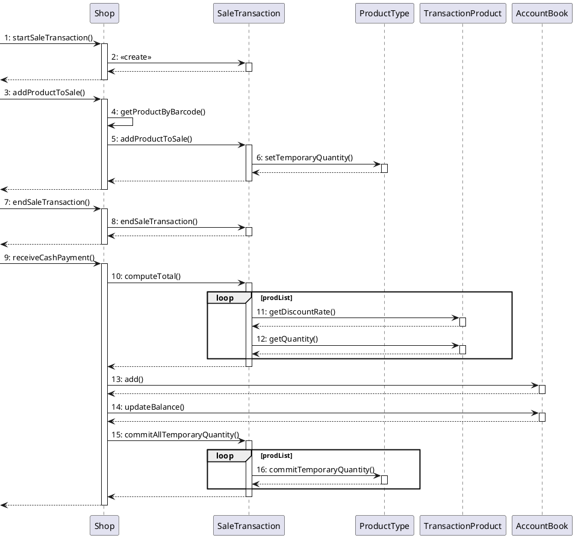
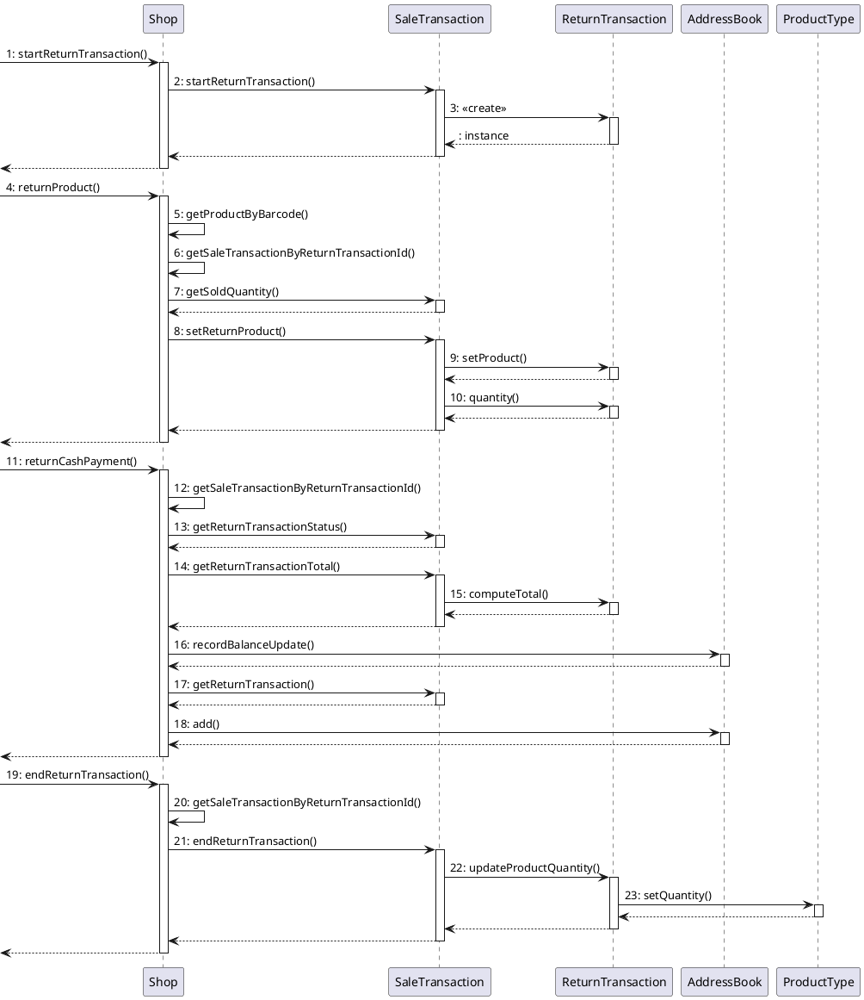

# Design Document


Authors: Battilana Matteo, Huang Chunbiao, Mondal Subhajit, Sabatini Claudia

Date: 26/04/2021

Version: 1.0


# Contents

- [Design Document](#design-document)
- [Contents](#contents)
- [Instructions](#instructions)
- [High level design](#high-level-design)
- [Low level design](#low-level-design)
- [Verification traceability matrix](#verification-traceability-matrix)
- [Verification sequence diagrams](#verification-sequence-diagrams)
  - [Sequence diagram for scenario "RECORD ORDER PRODUCT"](#sequence-diagram-for-scenario-record-order-product)
  - [Sequence diagram for scenario "6.4"](#sequence-diagram-for-scenario-64)
  - [Sequence diagram for scenario "6.3"](#sequence-diagram-for-scenario-63)

# Instructions

The design must satisfy the Official Requirements document, notably functional and non functional requirements

# High level design

<discuss architectural styles used, if any>
<report package diagram>


# Low level design


```plantuml
package it.polito.ezshop.model
package it.polito.ezshop.data
package it.polito.ezshop.exception
package it.polito.ezshop.gui

it.polito.ezshop.data --> it.polito.ezshop.model
it.polito.ezshop.data --> it.polito.ezshop.exception
```

```plantuml

  left to right direction
package it.polito.ezshop.data {

    class SingletonDatabaseConnection {
      - dbUrl: String
      + getInstance(): SingletonDatabaseConnection
      + getConnection(): Connection
    }
  class Shop {
    - loggedUser: User
    - allUsers: Map<Integer, User>
    - allSales: Map<Integer, SaleTransaction>
    - products: Map<Integer, ProductType>
    - orders: Map<Integer, Order>
    - customers: Map<Integer, Customer>
    - customerCards: Map<String, CustomerCard>
    - accountBook: AccountBook
    + reset(): Boolean
+ createUser(username: String, password: String, role: String): Integer
+ deleteUser(id: Integer): Boolean
+ getAllUsers(): List<User>
+ getUser(id: Integer): User
+ updateUserRights(id: Integer, role: String): Boolean
+ login(username: String, password: String): User
+ logout(): Boolean
+ createProductType(description: String, productCode: String, pricePerUnit: Double, note: String): Integer
+ updateProduct(id: Integer, newDescription: String, newCode: String, newPrice: Double, newNote: String): Boolean
+ deleteProductType(id: Integer): Boolean
+ getAllProductTypes(): List<ProductType>
+ getProductTypeByBarCode(barCode: String): ProductType
+ getProductTypesByDescription(description: String): List<ProductType>
+ updateQuantity(productId: Integer, toBeAdded: Integer): Boolean
+ updatePosition(productId: Integer, newPos: String): Boolean
+ issueReorder(productCode: String, quantity: Integer, pricePerUnit: Double): Integer
+ payOrderFor(productCode: String, quantity: Integer, pricePerUnit: Double): Integer
+ payOrder(orderId: Integer): Boolean
+ recordOrderArrival(orderId: Integer): Boolean
+ getAllOrders(): List<Order>
+ defineCustomer(customerName: String): Integer
+ modifyCustomer(id: Integer, newCustomerName: String, newCustomerCard: String): Boolean
+ deleteCustomer(id: Integer): Boolean
+ getCustomer(id: Integer): Customer
+ getAllCustomers(): List<Customer>
+ createCard(): String
+ attachCardToCustomer(customerCard: String, customerId: Integer): Boolean
+ modifyPointsOnCard(customerCard: String, pointsToBeAdded: Integer): Boolean
+ startSaleTransaction(): Integer
+ addProductToSale(transactionId: Integer, productCode: String, amount: Integer): Boolean
+ deleteProductFromSale(transactionId: Integer, productCode: String, amount: Integer): Boolean
+ applyDiscountRateToProduct(transactionId: Integer, productCode: String, discountRate: Double): Boolean
+ applyDiscountRateToSale(transactionId: Integer, discountRate: Double): Boolean
+ computePointsForSale(transactionId: Integer): Integer
+ endSaleTransaction(transactionId: Integer): Boolean
+ deleteSaleTransaction(transactionID: Integer): Boolean
+ getSaleTransaction(transactionId: Integer): Ticket
+ getTicketByNumber(transactionID: Integer): Ticket
+ startReturnTransaction(transactionID: Integer): Integer
+ returnProduct(returnId: Integer, productCode: String, amount: Integer): Boolean
+ endReturnTransaction(returnId: Integer, Boolean commit): Boolean
+ deleteReturnTransaction(returnId: Integer): Boolean
+ receiveCashPayment(transactionID: Integer, cash: Double): Double
+ receiveCreditCardPayment(transactionID: Integer, creditCard: String): Boolean
+ returnCashPayment(returnId: Integer): Double
+ returnCreditCardPayment(returnId: Integer, creditCard: String): Double
+ recordBalanceUpdate(toBeAdded: Double): Boolean
+ getCreditsAndDebits(LocalDate from, LocalDate to): List<BalanceOperation>
+ computeBalance(): Double
- getProductByBarcode(barcode: String): ProductType
- getSaleTransactionByReturnTransactionId(id: Integer): SaleTransaction
- loadFromDb(): Boolean
  }
  Shop -[hidden]-> SingletonDatabaseConnection
}

package it.polito.ezshop.model {

  note "All classes in the model package\nare persistent" as N1
  abstract class BalanceOperation {
    - amount: Dobule
    - description: String
    - date: LocalDate
  }
  class User {
    - id: Integer
    - name: String
    - surname: String
    - username: String
    - password: String
    - role: String
    + updateUserRights(role: String)
    + deleteFromDb(): Boolean
  }

  class ProductType{
      - id: Integer
      - barcode: String
      - description: String
      - pricePerUnit: Double
      - discountRate: Double
      - position: String
      - note: String
      - quantity: Integer
      - temporaryQuantity: Integer
      + updateProduct(newDescription: String, newCode: String, newPrice: Double, newNote: String): Boolean
      + updatePosition(newPos: String): Boolean
      + updateQuantity(toBeAdded: Integer): Boolean
      + updateTemporaryQuantity(toBeAdded: Integer): Boolean
      + commitTemporaryQuantity(): Boolean
      + deleteFromDb(): Boolean
  }
  class Order {
    - id: Integer
    - productType: ProductType
    - supplier: String
    - pricePerUnit: Double
    - quantity: Integer
    - status: String
    - arrival: LocalDate
    + recordOrderArrival(): Boolean
  }
  class CustomerCard {
      - id: String
      - points: Integer
      - customer: Customer
      + setCustomer(customer: Customer)
      + removeCustomer()
      + modifyPointsOnCard(pointsToBeAdded: Integer): Boolean
      + deleteFromDb(): Boolean
  }
  class Customer {
      - id: Integer
      - name: String
      + modifyCustomer(newCustomerName: String, newCustomerCard: String): Boolean
      + deleteFromDb(): Boolean
  }
  class SaleTransaction {
      - id: Integer
      - discount: Dobule
      - points: Integer
      - returnTransactions: Map<Integer, ReturnTransaction>
      - prodList: Map<ProductType, TransactionProduct>
      - status: String
      - customerCard: CustomerCard
      + setCustomerCard(CustomerCard): Boolean
      + addProductToSale(product: ProductType, amount: Integer): Boolean
      + deleteProductFromSale(product: String, amount: Integer): Boolean
      + applyDiscountRateToProduct(product: ProductType, discountRate: Double): Boolean
      + applyDiscountRateToSale(discountRate: Double): Boolean
      + computePointsForSale(): Integer
      + endSaleTransaction(): Boolean
      + startReturnTransaction(): ReturnTransaction
      + deleteReturnTransaction(): Boolean
      + getSoldQuantity(product: ProductType): Integer
      + computeTotal(): Double
      + endReturnTransaction(id: Integer, Boolean commit): Boolean
      + deleteReturnTransaction(id: Integer): Boolean
      + setReturnProduct(returnId: Integer, product: ProductType, amount: Integer): Boolean
      + getReturnTransactionStatus(id: Integer): Boolean
      + getReturnTransactionTotal(id: Integer): Boolean
      + getReturnTransaction(id: Integer): ReturnTransaction
      + commitAllTemporaryQuantity()
  }
  class ReturnTransaction {
    - id: Integer
    - product: ProductType
    - quantity: Integer
    - committed: String
    - status: Boolean
    + updateProductQuantity(): Boolean
    + computeTotal(): Double
    + deleteFromDb(): Boolean
  }
  class TransactionProduct {
    - quantity: Integer
    - discountRate: Double
    + applyDiscountRateToProduct(discountRate: Double): Boolean
    + deleteFromDb(): Boolean
  }

  class AccountBook{
    - balance: Double
    - opList: List<BalanceOperation>
    + recordBalanceUpdate(toBeAdded: Double): Boolean
    + add(BalanceOperation): Boolean
    + getCreditsAndDebits(LocalDate from, LocalDate to): List<BalanceOperation>
    + computeBalance(): Double
  }


  ReturnTransaction --|> BalanceOperation
  SaleTransaction --|> BalanceOperation
  Order -up-|> BalanceOperation

AccountBook --> BalanceOperation

SaleTransaction -right-> ReturnTransaction
SaleTransaction --> TransactionProduct
TransactionProduct --> ProductType
CustomerCard --> Customer
SaleTransaction --> CustomerCard

Order -right-> ProductType
ReturnTransaction --> ProductType
}

  Shop -> User
  Shop -> SaleTransaction
  Shop -> ProductType
  Shop -> Order
  Shop -> Customer
  Shop -> CustomerCard
  Shop -> AccountBook


Shop --> User

```
```plantuml
package it.polito.ezshop.exception {
class InvalidUsernameException
class InvalidPasswordException
class InvalidRoleException

class InvalidUserIdException
class UnauthorizedException

class InvalidProductDescriptionException
class InvalidProductCodeException
class InvalidPricePerUnitException
class InvalidProductIdException
class InvalidLocationException
class InvalidQuantityException

class InvalidOrderIdException
class InvalidCustomerNameException
class InvalidCustomerIdException
class InvalidCustomerCardException

class InvalidDiscountRateException
class InvalidTransactionIdException
class InvalidtransactionIDException

class InvalidCreditCardException
}


```

# Verification traceability matrix

|  | Position | Product Type| Quantity | Sale Transaction | Customer | Loyalty card| Return Transaction | Order        | Shop | User | Financial Transaction | Credit        | Debit   | Sale| Account Book |Product|
| :---: |:--------------:| :-------------:      | :---------: |:-------------:    | :-----:        | :-------------:      |:-------------:| :-------------: |:-------------:| :-------------: |:-------------:| :-------------: |:------------------:|:---:|:---:|:----:|
| FR1   || | || || ||X |X| || || | |
| FR3|X| X| ||X |X| || X|X| || || | |
| FR4 |X|X |X || || |X| X|X|X|| || | |
| FR5 || | ||X|X| ||X |X| || || | |
| FR6 ||X |X |X| X|X|X ||X |X|X || || | |
| FR7   || | || || ||X || X|| ||| |
| FR8   | || | || || |X| X|X| || | | |
|  | || | || || || || || | | |
|  | || | || || || || || | | |
|  | || | || || || || || | | |
|  | || | || || || || || | | |
|  | || | || || || || || | | |
|  | || | || || || || || | | |


# Verification sequence diagrams
\<select key scenarios from the requirement document. For each of them define a sequence diagram showing that the scenario can be implemented by the classes and methods in the design>


## Sequence diagram for scenario 1.1


## Sequence diagram for scenario 6.1 - scenario 7.4


## Sequence diagram for scenario 8.1 - scenario 7.4

