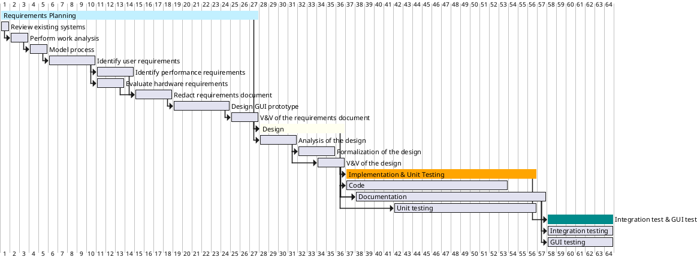

# Project Estimation  
Authors: Battilana Matteo, Huang Chunbiao, Mondal Subhajit, Sabatini Claudia

Date: 22/04/2021

Version: 1.0
# Contents
- [Estimate by product decomposition](#estimate-by-product-decomposition)
- [Estimate by activity decomposition](#estimate-by-activity-decomposition)

# Estimation approach
<Consider the EZGas  project as described in YOUR requirement document, assume that you are going to develop the project INDEPENDENT of the deadlines of the course>
# Estimate by product decomposition
###
|             | Estimate                        |             
| ----------- | ------------------------------- |  
| NC =  Estimated number of classes to be developed   |               21          |             
|  A = Estimated average size per class, in LOC       |           180                 |
| S = Estimated size of project, in LOC (= NC * A) | 3780 |   
| E = Estimated effort, in person hours (here use productivity 10 LOC per person hour)  |                378                     |   
| C = Estimated cost, in euro (here use 1 person hour cost = 30 euro) | 11340 |
| Estimated calendar time, in calendar weeks (Assume team of 4 people, 8 hours per day, 5 days per week ) |               2.36     |               
# Estimate by activity decomposition
###
|         Activity name    | Estimated effort (person hours)   |             
| ----------- | ------------------------------- |
| Requirements planning | **112**|
| &nbsp;&nbsp;&nbsp;&nbsp;&nbsp;Review existing systems | 8 |
| &nbsp;&nbsp;&nbsp;&nbsp;&nbsp;Perform work analysis | 8 |
| &nbsp;&nbsp;&nbsp;&nbsp;&nbsp;Model process | 4 |
| &nbsp;&nbsp;&nbsp;&nbsp;&nbsp;Identify user requirements | 16 |
| &nbsp;&nbsp;&nbsp;&nbsp;&nbsp;Identify performance requirements | 14 |
| &nbsp;&nbsp;&nbsp;&nbsp;&nbsp;Evaluate hardware requirements  | 14 |
| &nbsp;&nbsp;&nbsp;&nbsp;&nbsp;Redact requirements document  | 8 |
| &nbsp;&nbsp;&nbsp;&nbsp;&nbsp;Design GUI prototype  | 32 |
| &nbsp;&nbsp;&nbsp;&nbsp;&nbsp;V&V of the requirements document  | 8 |
| Design | **50** |
| &nbsp;&nbsp;&nbsp;&nbsp;&nbsp;Analysis of the design | 10 |
| &nbsp;&nbsp;&nbsp;&nbsp;&nbsp;Formalization of the design | 24 |
| &nbsp;&nbsp;&nbsp;&nbsp;&nbsp;V&V of the design | 16 |
| Implementation | **150** |
| &nbsp;&nbsp;&nbsp;&nbsp;&nbsp;Code | 150 |
| &nbsp;&nbsp;&nbsp;&nbsp;&nbsp;Documentation | 16 |
| Testing | **74** |
| &nbsp;&nbsp;&nbsp;&nbsp;&nbsp;Unit testing | 27  |
| &nbsp;&nbsp;&nbsp;&nbsp;&nbsp;Integration testing | 15 |
| &nbsp;&nbsp;&nbsp;&nbsp;&nbsp;On site test (at the shop) | 8 |
| &nbsp;&nbsp;&nbsp;&nbsp;&nbsp;GUI testing | 24 |
###

