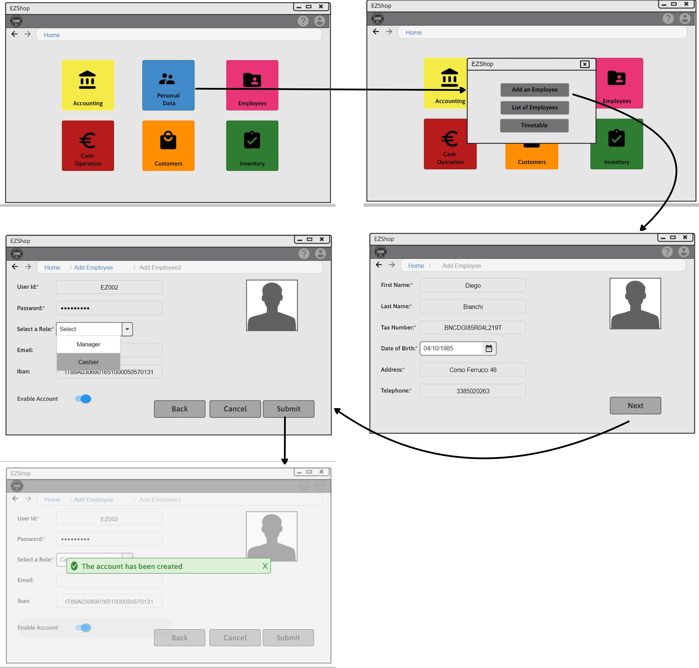
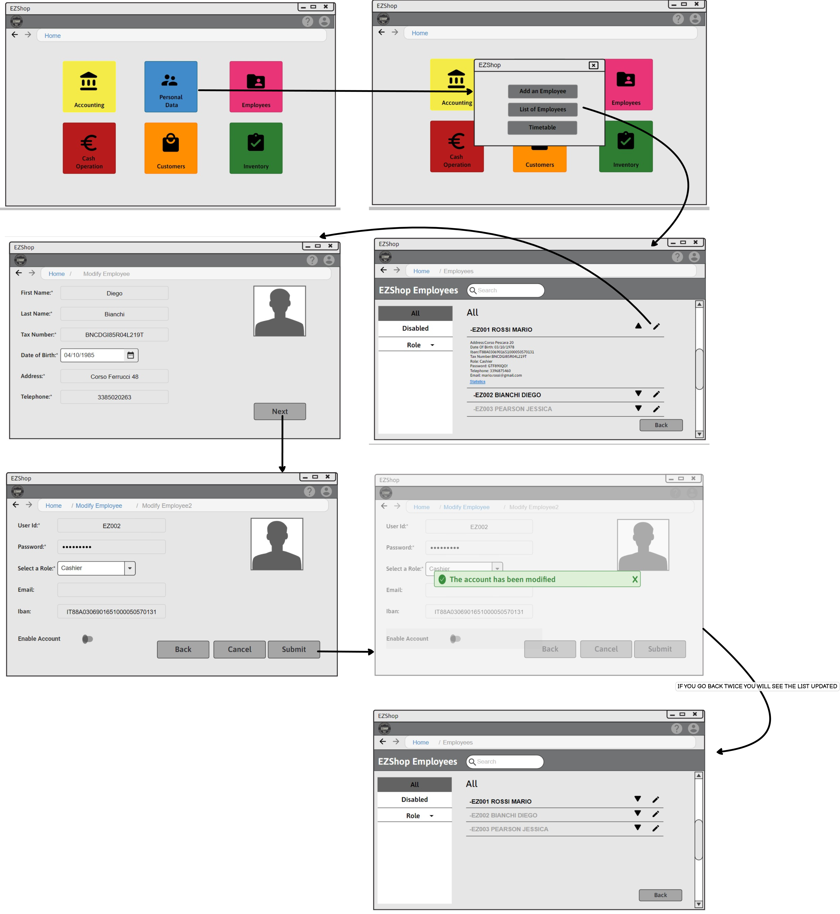
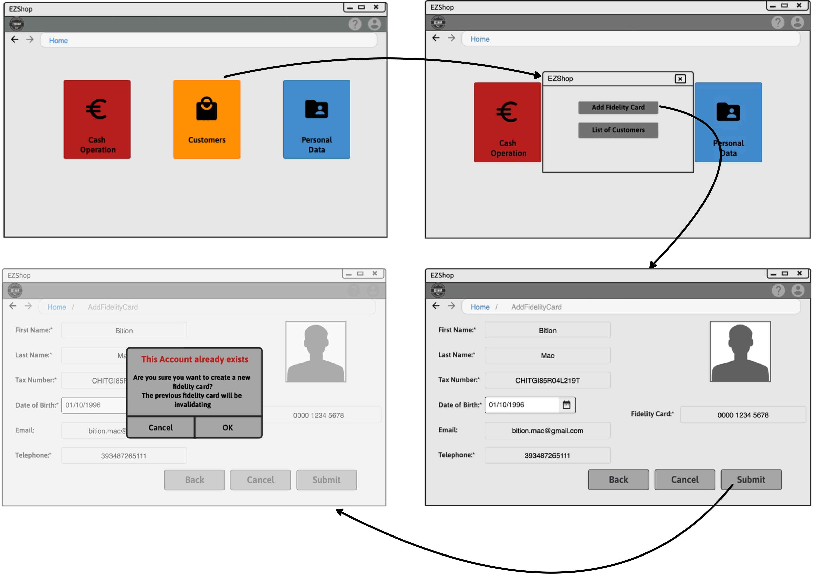
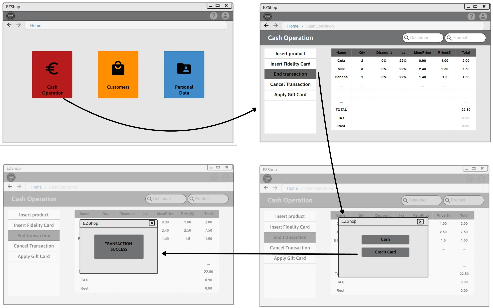

# Graphical User Interface Prototype  

Authors: Battilana Matteo, Huang Chunbiao, Mondal Subhajit, Sabatini Claudia

Date: 21/04/2021

Version: 1.2

# Contents
- [Use case 1, UC1 - Create a new Employee](#use-case-1-uc1-create-a-new-employee)
- [Use case 2, UC2 - Modify Employee](#use-case-2-uc2-modify-employee)
- [Use case 3, UC3 - Disable Employee](#use-case-3-uc3-disable-employee)
- [Use case 4, UC4 - Create a discount](#use-case-4-uc4-create-a-discount)
- [Use case 5, UC5 - Create a new fidelity card](#use-case-5-uc5-create-a-new-fidelity-card)
- [Use case 6, UC6 - Manage a sale transaction](#use-case-6-uc6-manage-a-sale-transaction)
- [Use case 7, UC7 - Log in](#use-case-7-uc7-log-in)
- [Use case 8, UC8 - Modify price of an item](#use-case-8-uc8-modify-price-of-an-item)
- [Use case 9, UC9 - Employee statistics](#use-case-9-uc9-employee-statistics)
- [Use case 10, UC10 - Manage Employee Work-Shift](#use-case-10-uc10-manage-employee-work-shift)

## Basic considerations
The GUI has been made with bright colors and big buttons in all the sections used by the Cashier in order to increase the usability with the Touchscreen and exploit the color association with the function. Different Home view are generated accordingly to the Employee permission.

### Use case 1, UC1 - Create a new Employee
 | Scenario 1.1 - Nominal  |
 | :----------- |
 |[Go to Scenario 1.1](./RequirementsDocument.md#scenario-11-nominal)|
 | |

 | Scenario 1.2 |
 | :----------- |
 |[Go to Scenario 1.2](./RequirementsDocument.md#scenario-12)|
 | |

### Use case 2, UC2 - Modify Employee
 | Scenario 2.1 - Nominal |
 | :----------- |
 |[Go to Scenario 2.1](./RequirementsDocument.md#scenario-21-nominal)|
 | |

### Use case 3, UC3 - Disable Employee
 | Scenario 3.1 - Nominal |
 | :----------- |
 |[Go to Scenario 3.1](./RequirementsDocument.md#scenario-31-nominal)|
 | |

### Use case 4, UC4 - Create a discount
 | Scenario 4.1 - Nominal |
 | :----------- |
 |[Go to Scenario 4.1](./RequirementsDocument.md#scenario-41-nominal)|
 | |

| Scenario 4.2 |
 | :----------- |
 |[Go to Scenario 4.2](./RequirementsDocument.md#scenario-42)|
 | |

### Use case 5, UC5 - Create a new fidelity card
 | Scenario 5.1 - Nominal |
 | :----------- |
 |[Go to Scenario 5.1](./RequirementsDocument.md#scenario-51-nominal)|
 | |

| Scenario 5.2 |
 | :----------- |
 |[Go to Scenario 5.2](./RequirementsDocument.md#scenario-52)|
 | |

### Use case 6, UC6 - Manage a sale transaction
 | Scenario 6.1 - Nominal |
 | :----------- |
 |[Go to Scenario 5.1](./RequirementsDocument.md#scenario-51-nominal)|
 | |

| Scenario 6.2 |
 | :----------- |
 |[Go to Scenario 6.2](./RequirementsDocument.md#scenario-62)|
 | |

  | Scenario 6.3 |
 | :----------- |
 |[Go to Scenario 6.3](./RequirementsDocument.md#scenario-63)|
 | |

| Scenario 6.4 |
 | :----------- |
 |[Go to Scenario 6.4](./RequirementsDocument.md#scenario-64)|
 | |

  | Scenario 6.5|
 | :----------- |
 |[Go to Scenario 6.5](./RequirementsDocument.md#scenario-65)|
 | |

### Use case 7, UC7 - Log in
 | Scenario 7.1 - Nominal |
 | :----------- |
 |[Go to Scenario 7.1](./RequirementsDocument.md#scenario-71)|
 | |

| Scenario 7.2 |
 | :----------- |
 |[Go to Scenario 7.2](./RequirementsDocument.md#scenario-72)|
 | |

### Use case 8, UC8 - Modify price of an item
 | Scenario 8.1 - Nominal |
 | :----------- |
 |[Go to Scenario 8.1](./RequirementsDocument.md#scenario-81)|
 | |

### Use case 9, UC9 - Employee statistics
 | Scenario 9.1 - Nominal |
 | :----------- |
 |[Go to Scenario 9.1](./RequirementsDocument.md#scenario-91)|
 | |

### Use case 10, UC10 - Manage Employee Work-Shift
 | Scenario 10.1 - Nominal |
 | :----------- |
 |[Go to Scenario 10.1](./RequirementsDocument.md#scenario-101)|
 | |

| Scenario 10.2|
 | :----------- |
 |[Go to Scenario 10.2](./RequirementsDocument.md#scenario-102)|
 | |
