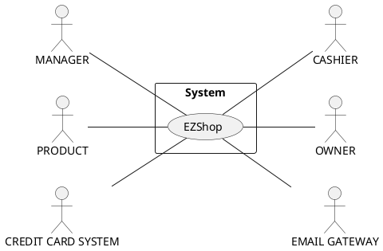
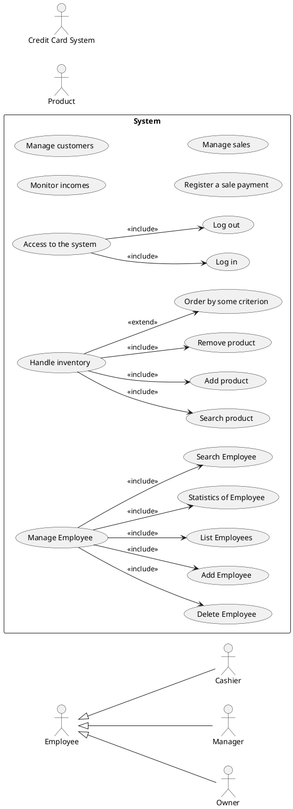
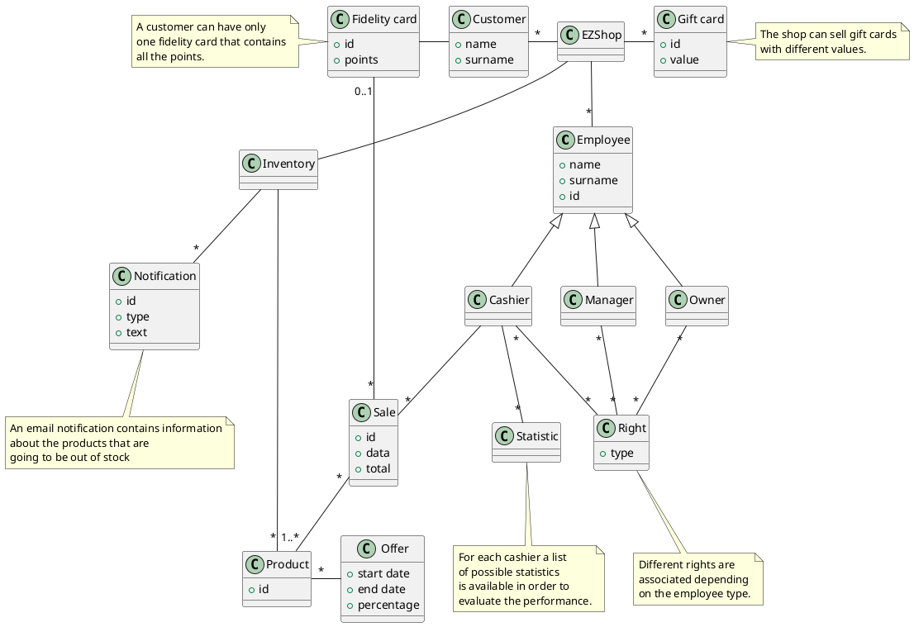
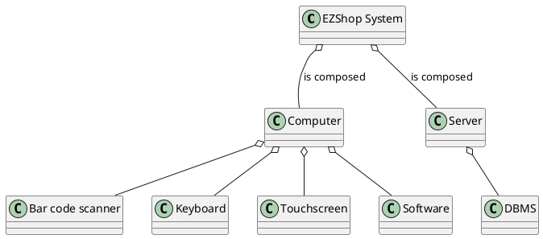
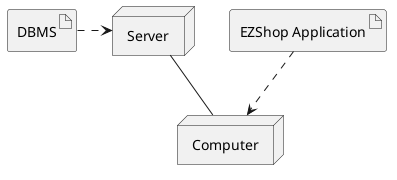

# Requirements Document

Authors: Battilana Matteo, Huang Chunbiao, Mondal Subhajit, Sabatini Claudia

Date: 08/04/2021

Version: 1.0

# Contents

- [Essential description](#essential-description)
- [Stakeholders](#stakeholders)
- [Context Diagram and interfaces](#context-diagram-and-interfaces)
	+ [Context Diagram](#context-diagram)
	+ [Interfaces](#interfaces)

- [Requirements Document](#requirements-document)
- [Contents](#contents)
- [Essential description](#essential-description)
- [Stakeholders](#stakeholders)
- [Context Diagram and interfaces](#context-diagram-and-interfaces)
	- [Context Diagram](#context-diagram)
	- [Interfaces](#interfaces)
- [Stories and personas](#stories-and-personas)
- [Functional and non functional requirements](#functional-and-non-functional-requirements)
	- [Functional Requirements](#functional-requirements)
- [access right, actor vs function](#access-right-actor-vs-function)
	- [Non Functional Requirements](#non-functional-requirements)
- [Use case diagram and use cases](#use-case-diagram-and-use-cases)
	- [Use case diagram](#use-case-diagram)
		- [Use case 1, UC1](#use-case-1-uc1)
				- [Scenario 1.1](#scenario-11)
				- [Scenario 1.2](#scenario-12)
				- [Scenario 1.x](#scenario-1x)
		- [Use case 2, UC2](#use-case-2-uc2)
		- [Use case x, UCx](#use-case-x-ucx)
- [Glossary](#glossary)
- [System Design](#system-design)
- [Deployment Diagram](#deployment-diagram)

# Essential description

Small shops require a simple application to support the owner or manager. A small shop (ex a food shop) occupies 50-200 square meters, sells 500-2000 different item types, has one or a few cash registers
EZShop is a software application to:
* manage sales
* manage inventory
* manage customers
* support accounting

# Stakeholders

| Stakeholder name  | Description |
| ----------------- |:-----------:|
| OWNER | Own the shop. want to use the application in order to make more efficient the shop's administration and to check  the performance of the shop and the employees   |
| MANAGER| Manages the application, can insert or delete products from the inventory, order products to the suppliers, supervise the shop and the others employees (cashier)|
| CASHIER | Handle the sales and handle the costumers|
| CUSTOMERS | Person that want to buy products in the shop |
| DB ADMINISTRATOR | ?? |
| SOFTWARE DEVELOPER | Writes the code by which the system is built, that installs also the application |
| SYSTEM DEVELOPER | Define the hardware that must be include in the final system in order to handle the payment and the product scan |
| CREDIT CARD SYSTEM | Service provided by merchant services and used by the application perform payment with credit/debit card |
| PRODUCT |  Product that has to be sold to the customers |
| SUPPLIER | Who supplies or delivers goods to the shop |
| EMAIL GATEWAY | This is the service used to send the email notifications |

# Context Diagram and interfaces

## Context Diagram

## Interfaces

| Actor | Logical Interface | Physical Interface  |
| ------------- |:-------------:| -----:|
|MANAGER| GUI | Screen Keyboard on PC, mouse|
|OWNER |GUI| Screen Keyboard on PC, mouse|
|CASHIER |GUI| Touchscreen, Keyboard on PC, mouse|
| CREDIT CARD SYSTEM | Web services (data exchange, soap + XML) | Internet connection |
| PRODUCT | Bar code reader laser | Bar code |
| EMAIL GATEWAY | IMAP (Internet Message Access Protocol) | Internet connection |

# Stories and personas

1. **Sharon**, 37, single mother of two girls aged 3 and 6 years, owner of a small
 grocery store is committed to providing hers customers seasonal and quality fruit and vegetables but admits that often reconcile management an activity and life as a mother is not so easy.
 This affects the organization of products in the warehouse that ends up rotting and must be thrown. For this reason,she would like to know, week by week which are the  goods that have been sold less than the other, so that the next week she will order a bit less, according to the numbers.

2. **Fabio**, 30, sporty, busy and dynamic man,is a owner of a several small sports supplement stores.
  He has made fitness and wellness his purpose of life and given the great demand
  of the market for these products his revenue is increasing considerably. For this reason he
  is thinking of hiring a manager to help him manage one of his shops.
  His main interest is to continue to manage every aspect of the shop at his best even if will not be always present.

3. **Alicia**, 44, a small businesswoman from Turin, owns a lovely shoes boutique.
  With the pandemic and with the economic crisis she is facing hard times but she does not give up to close permanently.
  Every day she searches in the list of sold product, written in the receipts, which one have been sold in order to compute manually the remaining inventory. She would    like to  have a software that helps her to keep track of all products, so that her shop will be never out of stock and never excess.

4. **Tom**, 22, an economics student to pay for his studies, works in a small hardware store,
 thanks to his skills with numbers and bureaucracy, he was recently promoted to manager of the activity.
 So now he has to take care of monitoring all aspects of the store, from inventory, to sales, to relationships with suppliers.
 He is very happy with his new role but he is aware of the responsibilities it entails
 and he would like to be able to combine work and studies well. So he is looking for an application that  allow him to satisfy the same tasks in less time and in a more efficient way.

5. **Jonathan**, 32, is the owner of a small book shop in an town; he has a tight budget and in order to cut the costs he has one stable cashier and some students that work on call, when they are free. He would like to have a software that is simply able to record his employees work shifts.

# Functional and non functional requirements

## Functional Requirements

| ID        | Description  |
| ------------- |-------------|
|  FR1 |Manage rights. Authorize access to functions to specific actors according to axcesss rights|
|FR2|	Manage employees|
|&nbsp;&nbsp;&nbsp;&nbsp;&nbsp;FR2.1| Modify or define a new employee (manager or cashier)|
|&nbsp;&nbsp;&nbsp;&nbsp;&nbsp;FR2.2 |Delete employee|
|&nbsp;&nbsp;&nbsp;&nbsp;&nbsp;FR2.3 |List of all the employees|
|&nbsp;&nbsp;&nbsp;&nbsp;&nbsp;FR2.4| Statistics of Employee, (for cashier daily earnings)|
|&nbsp;&nbsp;&nbsp;&nbsp;&nbsp;FR2.5 |Search Employee|
|FR3|Handle inventory|
|&nbsp;&nbsp;&nbsp;&nbsp;&nbsp;FR3.1 |Search product|
|&nbsp;&nbsp;&nbsp;&nbsp;&nbsp;FR3.2 |Order product to the suppliers|
|&nbsp;&nbsp;&nbsp;&nbsp;&nbsp;FR3.3 |Add product|
|&nbsp;&nbsp;&nbsp;&nbsp;&nbsp;FR3.4 |Remove product (automatically + manually)|
|&nbsp;&nbsp;&nbsp;&nbsp;&nbsp;FR3.5 |List of products + prices + number of products orderd by some criterion (list of multiple choices)|
|&nbsp;&nbsp;&nbsp;&nbsp;&nbsp;FR3.6| Email notification when product is out of stock|
|FR4|Manage customers|
|&nbsp;&nbsp;&nbsp;&nbsp;&nbsp;FR4.1 |Create a new fidelity card (with an ID)|
|&nbsp;&nbsp;&nbsp;&nbsp;&nbsp;FR4.5 |Add new customer + unique id |
|&nbsp;&nbsp;&nbsp;&nbsp;&nbsp;FR4.2 |List of all the customers|
|&nbsp;&nbsp;&nbsp;&nbsp;&nbsp;FR4.3 |Mark points every tot of shop (ex every 50 spent give them 1 point after 10 point 20% discount)|
|&nbsp;&nbsp;&nbsp;&nbsp;&nbsp;FR4.4| Give a discount |
|FR5|Manage sales|
|&nbsp;&nbsp;&nbsp;&nbsp;&nbsp;FR5.1| List of best selling products|
|&nbsp;&nbsp;&nbsp;&nbsp;&nbsp;FR5.2 |List of daily sales|
|&nbsp;&nbsp;&nbsp;&nbsp;&nbsp;FR5.3 |List of offers (ex with products in expiration)|
|&nbsp;&nbsp;&nbsp;&nbsp;&nbsp;FR5.4 |Create an offer|
|&nbsp;&nbsp;&nbsp;&nbsp;&nbsp;FR5.5 |Delete offer|
|&nbsp;&nbsp;&nbsp;&nbsp;&nbsp;FR5.7 |Create a gift card|
|&nbsp;&nbsp;&nbsp;&nbsp;&nbsp;FR5.8 |Delete gift card|
|FR6|Access to the system|
|&nbsp;&nbsp;&nbsp;&nbsp;&nbsp;FR6.1 |Log in|
|&nbsp;&nbsp;&nbsp;&nbsp;&nbsp;FR6.2 |Log out|
|FR7|Monitor incomes|
|&nbsp;&nbsp;&nbsp;&nbsp;&nbsp;FR7.1| Daily income|
|&nbsp;&nbsp;&nbsp;&nbsp;&nbsp;FR7.2 |Monthly income|
|&nbsp;&nbsp;&nbsp;&nbsp;&nbsp;FR7.3 |Year income|
|FR8|Register a sale payment |
|&nbsp;&nbsp;&nbsp;&nbsp;&nbsp;FR8.1| Scan product|
|&nbsp;&nbsp;&nbsp;&nbsp;&nbsp;FR8.2 |Apply possible discount|
|&nbsp;&nbsp;&nbsp;&nbsp;&nbsp;FR8.3 |Use possible gift card|
|&nbsp;&nbsp;&nbsp;&nbsp;&nbsp;FR8.4 | Get the receipt|
|&nbsp;&nbsp;&nbsp;&nbsp;&nbsp;FR8.5 | Compute the sum|
|&nbsp;&nbsp;&nbsp;&nbsp;&nbsp;FR8.6 |Get paid (credit card, cash)|
|&nbsp;&nbsp;&nbsp;&nbsp;&nbsp;FR8.7 |Store the information about the transaction (sale, cashier and customer) |
|&nbsp;&nbsp;&nbsp;&nbsp;&nbsp;FR8.8 |Update inventory|

## Access right, actor vs function

| Function        | Owner | Manager | Cashier|
| ------------- |:-------------:| ------------- |:-------------:|
|FR1| &check;|  ||
|FR2.1| &check; | | |
|FR2.2| &check;|  ||
|FR2.3|&check;| &check;||  
|FR2.4|&check;| &check;||
|FR3.1|&check;| &check;| &check;|
|FR3.2|&check;| &check;||  
|FR3.3| &check;| &check;||
|FR3.4| &check;| &check;||
|FR3.5| &check;| &check;||
|FR4| &check;| &check; ||
|FR4.1| &check;| &check; |&check;|
|FR4.4| &check;| &check; |&check;|
|FR5 |&check;| &check; ||
|FR6 |&check;| &check; |&check;|
|FR7 |&check;| &check;||
|FR8 |&check;| &check; |&check;|

## Non Functional Requirements

| ID        | Type (efficiency, reliability, ..)           | Description  | Refers to |
| ------------- |:-------------:| :-----:| -----:|
|NFR1| USABILITY | Every customer with at least 3+ years experience in using a PC must be able to use all functions with no training in less than 30 minutes| All FR |
|NFR2| PERFORMANCE| All function should respond in <0.5 sec| All FR, excluded FR8.5, FR8.6, FR8.4 |
|NFR3| PRIVACY| The system must must store data in a safe way, in order to avoid information disclosure | FR2, FR3, FR4.5, FR7, FR8.7 |           
|NFR4| AVAILABILITY | The system must be available for least 99% of the time|All FR|
|NFR5| PORTABILITY| The application should be working in a Windows 10 operating system, build version 1809|All FR|
|NFR6| SECURITY| The data of one cashier can be visible and modifiable only by the owner and the manager. The data should be disclosed to other cashiers at the same or lower level. |FR2|
|NFR7| SECURITY| The system must be protected from an unauthorized access by using id and password|FR6|    
|NFR8| SECURITY | The credit card information should never be recorded into the system | FR8.6 |    
|NFR9| LOCALISATION | The prices are managed and displayed with the local currency with two decimals. This includes also the | FR8.5 |
|NFR10| LOCALISATION | VAT application on the final price depends on the local national law | FR8.5 |
|NFR11| LOCALISATION | Data protection must be in accordance with the local law (GDPR for Europe)| FR2, FR3, FR4.5, FR7, FR8.7 |

# Use case diagram and use cases
## Use case diagram

\<ideas of use cases>
| UC     | Description |
| ------------- |:-------------:|
|UC1.| Create account for new employee |
|UC2. |Modify account for employee|
|UC3. |Delete account for employee|
|UC4. |Add product to the inventory|
|UC5. |Order product to the supplier|
|UC6. |Create an offer|
|UC7. |Remove an offer|
|UC8. |Add new fidelity card (add new customer)|
|UC9. |Mark point to the fidelity card (modify customer)|
|UC10.|Give a discount|
|UC11.|Search item|
|UC12 |Log in|
|UC13 |Modify price of an item|
|UC14 |Show the inventory of all items|
|UC15 |Check daily sales|
|UC16 |Accounting (per day, week, month, year)|

\<next describe here each use case in the UCD>
### Use case 1, UC1 - Create a new employee
| Actors Involved        |  |
| ------------- |:-------------:|
|  Precondition     | The owner is logged in |  
|  Post condition     | A new employee is added into the system |
|  Nominal Scenario     | The owner select with the appropriate button the employee section, then he click over a button that prompt a windows that must be filled with the new employee's information |
|  Variants     | Owner provide person's information that already match with one employee in the system The application will notify this information in the same window |

##### Scenario 1.1

| Scenario 1.1 | |
| ------------- |:-------------:|
| Description | Owner wants to add a new employee to the ones already in the system for the EZShop|
| Precondition |  Owner is logged in|
| Post condition |  A new employee is added to into the system |
|  1     | Owner click on the employees section |  
|  2     | Owner click on the create new employee button |
|  3     | A window is opened with all necessary fields to be filled |
|  4     | Owner enters the new employee information and select if it is a manager or a cashier |
|  5     | Owner confirm the operation by clicking on the appropriate button |

##### Scenario 1.2

| Scenario 1.2 | |
| ------------- |:-------------:|
| Description | Owner wants to add a new employee that is already in the system for the EZShop|
| Precondition |  Owner is logged in|
| Post condition |  The entered employee is already in the system, the new employee is not added |
|  1     | Owner click on the employees section |  
|  2     | Owner click on the create new employee button |
|  3     | A window is opened with all necessary fields to be filled |
|  4     | Owner enters the new employee information and select if it is a manager or a cashier |
|  5     | Owner confirm the operation by clicking on the appropriate button |
|  6     | An alert notify that the employee is already in the system |
|  5     | Owner cancel the operation by clicking on the appropriate button |

### Use case 8, UC8 - Create a new fidelity card
| Actors Involved        |  |
| ------------- |:-------------:|
|  Precondition     | The cashier wants to create a new fidelity card for a customer |  
|  Post condition     | A new customer and the related fidelity card is added to the system |
|  Nominal Scenario     | The cashier select with the appropriate button the custom section, then he click over a button that prompt a windows that must be filled with the new customer information |
|  Variants     | Owner insert customer's information that already match with one customer in the system The application will notify this information in the same window |

##### Scenario 8.1 - Nominal

| Scenario 8.1 | |
| ------------- |:-------------:|
| Description | The cashier wants to add a new customer and its fidelity card|
|  Precondition     | The cashier wants to create a new fidelity card for a customer |  
|  Post condition     | A new customer and the related fidelity card is added to the system |
|  1     | Cashier clicks on the customer section |  
|  2     | Cashier clicks on the create new customer button |
|  3     | A window is opened with all necessary fields to be filled |
|  4     | Cashier enters the new customer information |
|  5     | Owner confirm the operation by clicking on the appropriate button |

##### Scenario 8.2

| Scenario 8.2 | |
| ------------- |:-------------:|
| Description | Owner wants to add a new employee that is already in the system for the EZShop|
|  Precondition     | The cashier wants to create a new fidelity card for a customer |  
|  Post condition     | The customer is not added to the system because already present |
|  1     | Cashier clicks on the customer section |  
|  2     | Cashier clicks on the create new customer button |
|  3     | A window is opened with all necessary fields to be filled |
|  4     | Cashier enters the new customer information |
|  5     | Owner confirm the operation by clicking on the appropriate button |

### Use case 12, UC12 - Log in
| Actors Involved        |  |
| ------------- |:-------------:|
|  Precondition     | The employee is not logged in |  
|  Post condition     | The employee is logged into the system, all functions based on the access rights are available  |
|  Nominal Scenario     | The employee enters his user id and password in the login form and then clicks on the confirmation button |
|  Variants     | The employee enters wrong a wrong user id or password, the system notifies a login error |

##### Scenario 12.1 - Nominal

| Scenario 12.1 | |
| ------------- |:-------------:|
| Description | The employee wants to log in to the system in order to use its functions  |
| Precondition |  The employee is not logged in the system and the application is already opened and running in the computer |
| Postcondition |  The employee is logged in |
|  1     | The user click on the login button and a form is opened |  
|  2     | The user enter his credential |
|  3     | The user confirm with the appropriate button |

##### Scenario 12.2

| Scenario 12.2 | |
| ------------- |:-------------:|
| Description | The employee wants to log in to the system in order to use its functions  |
| Precondition |  The employee is not logged in the system and the application is already opened and running in the computer |
| Postcondition |  The employee is not logged in |
|  1     | The user click on the login button and a form is opened |  
|  2     | The user enter wrong credential |
|  3     | The user can enter again the credential |

### Use case 2, UC2
| Actors Involved        |  |
| ------------- |:-------------:|
|  Precondition     | \<Boolean expression, must evaluate to true before the UC can start> |  
|  Post condition     | \<Boolean expression, must evaluate to true after UC is finished> |
|  Nominal Scenario     | \<Textual description of actions executed by the UC> |
|  Variants     | \<other executions, ex in case of errors> |

### Use case x, UCx
..

# Glossary

\<use UML class diagram to define important terms, or concepts in the domain of the system, and their relationships>

\<concepts are used consistently all over the document, ex in use cases, requirements etc>

# System Design

# Deployment Diagram

