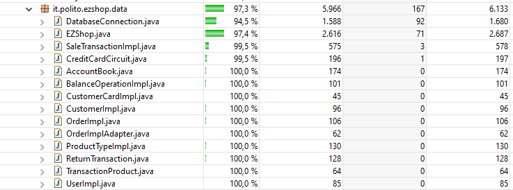

# Unit Testing Documentation

Authors:

Date:

Version:

# Contents

- [Black Box Unit Tests](#black-box-unit-tests)

- [White Box Unit Tests](#white-box-unit-tests)

# Black Box Unit Tests

    <Define here criteria, predicates and the combination of predicates for each function of each class.
    Define test cases to cover all equivalence classes and boundary conditions.
    In the table, report the description of the black box test case and (traceability) the correspondence with the JUnit test case writing the 
    class and method name that contains the test case>
    <JUnit test classes must be in src/test/java/it/polito/ezshop   You find here, and you can use,  class TestEzShops.java that is executed  
    to start tests
    All the methods in the classes without dependecies have been tested.Here have been reported the methods of the classes with some logic inside. You can find all the methods here src/test/java/it/polito/ezshop 
    >

 ### **Class *BalanceOperationImpl***

**Criteria for method *setBalanceId*:**
	
 - Validity of the id

**Predicates for method *setBalanceId*:**

| Criteria | Predicate |
| -------- | --------- |
| Validity of the id         |  (minint, 1)   |
|                             | [1, maxint)   |

**Boundaries**:

| Criteria | Boundary values |
| -------- | --------------- |
| Validity of the id           |   0,1,maxint             |
|          |                 |

**Combination of predicates**:

| Validity of the id | Valid / Invalid | Description of the test case | JUnit test case |
|-------|-------|-------|-------|
| (minint, 1)| Invalid|T1(-5) -> new id no setted T1b(0) -> new id no setted | BalanceOperationImplTest.java-> negativeSetBalanceId()|
|[1, maxint)|Valid|T2(15)->new id setted  T2b(maxint)->new id setted|BalanceOperationImplTest.java-> positiveSetBalanceId()|

**Criteria for method *setDate*:**
	
 - Validity of the Date
  
**Predicates for method *setDate*:**

| Criteria | Predicate |
| -------- | --------- |
|Validity of the Date         |  Valid   |
|                             | NULL |

**Combination of predicates**:

| Validity of the Date  | Valid / Invalid | Description of the test case | JUnit test case |
|-------|-------|-------|-------|
| NULL| Invalid|T1(null)->new date no setted| BalanceOperationImplTest.java-> nullSetDate()|
| Valid| Valid|Date=LocalDate.of(2022,10,12) T2(Date)->new date setted| BalanceOperationImplTest.java-> positiveSetDate()|

**Criteria for method *setType*:**
	
 - Validity of the Type
 - Validity of the Parameters Type
  

**Predicates for method *setType*:**

| Criteria | Predicate |
| -------- | --------- |
|Validity of the Type        |  Valid   |
|                             | NULL |
|Validity of the Parameters Type        |  Valid ("SALE","ORDER","RETURN","DEBIT","CREDIT")  |
|                             | Invalid |

**Combination of predicates**:

| Validity of the Type  | Validity of the Parameters Type  | Valid / Invalid | Description of the test case | JUnit test case |
|-------|-------|-------|-------|-------|
| NULL| *|Invalid|T1(null)->new type no setted| BalanceOperationImplTest.java-> nullSetType()|
|*|Invalid| Invalid|T2(" ")->new type no setted| BalanceOperationImplTest.java-> invalidSetType()|
|Valid|Valid("SALE","ORDER","RETURN","DEBIT","CREDIT")| Valid |T3("SALE ")->new type setted   T3.1("ORDER")->new type setted  T3.2("RETURN")->new type setted  T3.3("DEBIT")->new type setted   T3.4("CREDIT")->new type setted     | BalanceOperationImplTest.java-> positiveSetType()|

**Criteria for method *setStatus*:**
	
 - Validity of the Status
 - Validity of the Parameters Status
  

**Predicates for method *setStatus*:**

| Criteria | Predicate |
| -------- | --------- |
|Validity of the Status      |  Valid   |
|                             | NULL |
|Validity of the Parameters Status       |  Valid ("PAID","UNPAID") |
|                             | Invalid |

**Combination of predicates**:

| Validity of the Status  | Validity of the Parameters Status  | Valid / Invalid | Description of the test case | JUnit test case |
|-------|-------|-------|-------|-------|
| NULL| *|Invalid|T1(null)->new status no setted| BalanceOperationImplTest.java-> nullSetStaus()|
|*|Invalid| Invalid|T2(" ")->new status no setted| BalanceOperationImplTest.java-> invalidSetStaus()|
|Valid|Valid("PAID","UNPAID")| Valid |T3("PAID ")->new status setted   T3.1("UNPAID")->new status setted| BalanceOperationImplTest.java-> positiveSetStaus()|

### **Class *UserImpl***

**Criteria for method *setId*:**
	
 - Validity of the id

**Predicates for method *setId*:**

| Criteria | Predicate |
| -------- | --------- |
| Validity of the id         |  (minint, 0)   |
|                             | [0, maxint)   |

**Boundaries**:

| Criteria | Boundary values |
| -------- | --------------- |
| Validity of the id           |   -1,0,maxint  |
|          |                 |

**Combination of predicates**:

| Validity of the id | Valid / Invalid | Description of the test case | JUnit test case |
|-------|-------|-------|-------|
| (minint, 0)| Invalid|T1(-5) -> new id no setted T1b(1) -> new id no setted | UserImplTest.java-> negativeSetId()|
|[0, maxint)|Valid|T2(5)->new id setted  T2b(maxint)->new id setted|UserImplTest.java-> positiveSetId()|

**Criteria for method *setUsername*:**
	
 - Validity of the String Username
 - Lenght of the String Userame
  

**Predicates for method *setUsername*:**

| Criteria | Predicate |
| -------- | --------- |
|Validity of the String Username  |  Valid   |
|                             | NULL |
|Lenght of the String Username      | >0 |
|                             | =0 ("") |

**Combination of predicates**:

| Validity of the String Username | Lenght of the String Username   | Valid / Invalid | Description of the test case | JUnit test case |
|-------|-------|-------|-------|-------|
| NULL| *|Invalid|T1(null)->new username no setted| UserImplTest.java->nullSetUsername()|
|*|=0| Invalid|T2("")->new username no setted| UserImplTest.java->invalidSetUsername()|
|Valid|>0| Valid|T3"SaraR")->new username setted| UserImplTest.java->positiveSetUsername()|

**Criteria for method *setPassword*:**
	
 - Validity of the String Password
 - Lenght of the String Password
  

**Predicates for method *setPassword*:**

| Criteria | Predicate |
| -------- | --------- |
|Validity of the String Password  |  Valid   |
|                             | NULL |
|Lenght of the String Password     | >0 |
|                             | =0 ("") |

**Combination of predicates**:

| Validity of the String Password | Lenght of the String Password  | Valid / Invalid | Description of the test case | JUnit test case |
|-------|-------|-------|-------|-------|
| NULL| *|Invalid|T1(null)->new password no setted| UserImplTest.java->nullSetPassword()|
|*|=0| Invalid|T2("")->new password no setted| UserImplTest.java->invalidSetPassword()|
|Valid|>0| Valid|T3("passWORD")->new password setted| UserImplTest.java->positiveSetPassword()|

**Criteria for method *setRole*:**
	
 - Validity of the String Role
 - Lenght of the String Role
 - Validity of the Parameters Role 
  

**Predicates for method *SetRole*:**

| Criteria | Predicate |
| -------- | --------- |
|Validity of the String Role |  Valid   |
|                             | NULL |
|Lenght of the String Role    | >0 |
|                             | =0 ("") |
|Validity of the Parameters Role       |  Valid ("Administrator","Cashier","ShopManager") |
|                             | Invalid |

**Combination of predicates**:

| Validity of the String Role| Lenght of the StringRole  |Validity of the Parameters Role| Valid / Invalid | Description of the test case | JUnit test case |
|-------|-------|-------|-------|-------|-------|
| NULL| *| *|Invalid|T1(null)->new role no setted| UserImplTest.java->nullSetRole()|
|*|=0| *| Invalid|T2("")->new role no setted| UserImplTest.java->invalidExistenceSetRole()|
|*|>0| Invalid| Invalid|T3("Manager")->new role no setted| UserImplTest.java->invalidSetRole()|
|Valid|>0| Valid("Administrator","Cashier","ShopManager")|Valid|T4("ShopManager")->new role setted  T4.1("Cashier")->new role setted  T4.2("Administrator")->new role setted  | UserImplTest.java->positiveSetRole()|

### **Class *ProductTypeImpl***

**Criteria for method *setId*:**
 - Size of the Parameter of the id 	
 - Validity of the id

**Predicates for method *setId*:**

| Criteria | Predicate |
| -------- | --------- |
| Size of the Parameter of the id         |  (minint, 1)   |
|                             | [1, maxint)  |
| Validity of the id | Valid |
|                             | NULL |

**Boundaries**:

| Criteria | Boundary values |
| -------- | --------------- |
| Size of the Parameter of the id          |   0,1 ,maxint |
|          |                 |

**Combination of predicates**:

|Size of the Parameter of the id  |   Validity of the id | Valid / Invalid | Description of the test case | JUnit test case |
|-------|-------|-------|-------|-------|
| (minint, 1)|*| Invalid|T1(-5) -> new id no setted T1b(0) -> new id no setted | ProductTypeImplTest.java-> negativeSetId()|
| * |NULL| Invalid|T2(null) -> new id no setted setted| ProductTypeImplTest.java-> nullSetId()|
|[1, maxint)|Valid|Valid|T3(5)->new id setted  T3b(maxint)->new id setted|ProductTypeImplTest.java-> positiveSetId()|

**Criteria for method *setQuantity*:**
 - Size of the Parameter of the quantity	
 - Validity of the quantity

**Predicates for method *setQuantity*:**

| Criteria | Predicate |
| -------- | --------- |
| Size of the Parameter of the quantity	      |  (minint, 0)   |
|                             | [0, maxint)  |
| Validity of the quantity| Valid |
|                             | NULL |

**Boundaries**:

| Criteria | Boundary values |
| -------- | --------------- |
|Size of the Parameter of the quantity	 |   -1,0,maxint  |
|          |                 |

**Combination of predicates**:

|Size of the Parameter of the quantity	 |   Validity of the quantity | Valid / Invalid | Description of the test case | JUnit test case |
|-------|-------|-------|-------|-------|
| (minint, 0)|*| Invalid|T1(-5) -> new quantity no setted T1b(-1) -> new quantity no setted | ProductTypeImplTest.java-> negativeSetQuantity()|
| * |NULL| Invalid|T2(null) -> new quantity no setted setted| ProductTypeImplTest.java-> invalidSetIQuantity()|
|[0, maxint)|Valid|Valid|T3(20)->new quantity setted  T3b(maxint) -> new quantity setted |ProductTypeImplTest.java-> positiveSetQuantity()

**Criteria for method *setPricePerUnit*:**
 - Size of the Parameter of the PricePerUnit	
 - Validity of the PricePerUnit

**Predicates for method *setQuantity*:**

| Criteria | Predicate |
| -------- | --------- |
| Size of the Parameter of the PricePerUnit	  |  (-maxdouble, 0)   |
|                             | [0, maxdouble)  |
| Validity of the PricePerUnit| Valid |
|                             | NULL |

**Boundaries**:

| Criteria | Boundary values |
| -------- | --------------- |
| Size of the Parameter of the PricePerUnit |   -0.0001,0,0.0001 |
|          |                 |

**Combination of predicates**:

|Size of the Parameter of the PricePerUnit	 |   Validity of the PricePerUnit| Valid / Invalid | Description of the test case | JUnit test case |
|-------|-------|-------|-------|-------|
| (-maxdouble, 0)|*| Invalid|T1(-0.50) -> new PricePerUnit no setted T1b(-0.0001) -> new PricePerUnit no setted | ProductTypeImplTest.java-> negativeSetPricePerUnit()|
| * |NULL| Invalid|T2(null) -> new PricePerUnit no setted setted| ProductTypeImplTest.java-> invalidSetIPricePerUnit()|
|[0, maxdouble)|Valid|Valid|T3(0.60)->new PricePerUnit setted T3b(0.0001) -> new PricePerUnit setted|ProductTypeImplTest.java-> positiveSetPricePerUnit()

**Criteria for method *setBarCode*:**
	
 - Validity of the String BarCode
 - Lenght of the String BarCode
  

**Predicates for method *setBarCode*:**

| Criteria | Predicate |
| -------- | --------- |
|Validity of the String BarCode |  Valid   |
|                             | NULL |
|Lenght of the String BarCode      | >0 |
|                             | =0 ("") |

**Combination of predicates**:

| Validity of the String BarCode| Lenght of the String BarCode  | Valid / Invalid | Description of the test case | JUnit test case |
|-------|-------|-------|-------|-------|
| NULL| *|Invalid|T1(null)->new BarCode no setted| ProductTypeImplTest.java->nullSetBarCode()|
|*|=0| Invalid|T2("")->new BarCode no setted| ProductTypeImplTest.java->invalidSetBarCode()|
|Valid|>0| Valid|T3("78515420")->new BarCode setted| ProductTypeImplTest.java.java->positiveSetBarCode()|

**Criteria for method *setDescription*:**
	
 - Validity of the String Description
 - Lenght of the String Description
  

**Predicates for method *setDescription*:**

| Criteria | Predicate |
| -------- | --------- |
|Validity of the String Description |  Valid   |
|                             | NULL |
|Lenght of the String Description    | >0 |
|                             | =0 ("") |

**Combination of predicates**:

| Validity of the String Description| Lenght of the String Description  | Valid / Invalid | Description of the test case | JUnit test case |
|-------|-------|-------|-------|-------|
| NULL| *|Invalid|T1(null)->new Description no setted| ProductTypeImplTest.java->nullSetDescription()|
|*|=0| Invalid|T2("")->new Description no setted| ProductTypeImplTest.java->invalidSetDescription()|
|Valid|>0| Valid|T3("yellow")->new Description setted| ProductTypeImplTest.java->positiveSetDescription()|

**Criteria for method *setNote*:**
	
 - Validity of the String Note
 - Lenght of the String Note
  

**Predicates for method *setNote*:**

| Criteria | Predicate |
| -------- | --------- |
|Validity of the String Note |  Valid   |
|                             | NULL |
|Lenght of the String Note   | >0 |
|                             | =0 ("") |

**Combination of predicates**:

| Validity of the String Note| Lenght of the String Note  | Valid / Invalid | Description of the test case | JUnit test case |
|-------|-------|-------|-------|-------|
| NULL| *|Invalid|T1(null)->new Note no setted| ProductTypeImplTest.java->nullSetNote()|
|*|=0| Invalid|T2("")->new Note no setted| ProductTypeImplTest.java->invalidSetNote()|
|Valid|>0| Valid|T3("bad")->new Note setted| ProductTypeImplTest.java->positiveSetNote()|

### **Class *CreditCardCircuit***

**Criteria for method *isValid*:**
	
 - Validity of the Credit Card

**Predicates for method *isValid*:**

| Criteria | Predicate |
| -------- | --------- |
| Validity of the Credit Card       | Valid(if credit card is in the file) |
|                             | Invalid(if credit card is not in the file)|

**Combination of predicates**:

|  Validity of the Credit Card  | Valid / Invalid | Description of the test case | JUnit test case |
|-------|-------|-------|-------|
|Invalid(credit card is not in the file) | Invalid|T1("4485370086510890") -> false | CreditCardCircuitTest.java-> negativeValidity()|
|Valid (credit card is in the file)|Valid|T2("4485370086510891")->true|CreditCardCircuitTest.java-> positiveValidity()|

# White Box Unit Tests

### Test cases definition
    
    <JUnit test classes must be in src/test/java/it/polito/ezshop>
    <Report here all the created JUnit test cases, and the units/classes under test >
    <For traceability write the class and method name that contains the test case>

##CreditCardCircuit-  method *pay*
| Unit name | JUnit test case |
|--|--|
|CreditCardCircuit| CreditCardCircuitTest->positivePayCreditCard()|
|CreditCardCircuit|CreditCardCircuitTest->negativePayCreditCard()|
|CreditCardCircuit|CreditCardCircuitTest->invalidPayCreditCard()|
|CreditCardCircuit| CreditCardCircuitTest->invalidMoneyPayCreditCard()|

### Loop coverage analysis

    <Identify significant loops in the units and reports the test cases
    developed to cover zero, one or multiple iterations >

|Unit name | Loop rows | Number of iterations | JUnit test case |
|---|---|---|---|
|CreditCardCircuit|?|?|CreditCardCircuitTest->positivePayCreditCard()|
|CreditCardCircuit|?|?|CreditCardCircuitTest->negativePayCreditCard()|
|CreditCardCircuit|?|?|CreditCardCircuitTest->invalidPayCreditCard()|
|CreditCardCircuit|?|?|CreditCardCircuitTest->invalidMoneyPayCreditCard()|

##CreditCardCircuit-  method *validateCreditCard*
| Unit name | JUnit test case |
|--|--|
|CreditCardCircuit| CreditCardCircuitTest->positiveValidateCreditCard()|
|CreditCardCircuit|CreditCardCircuitTest->negativeValidateCreditCard()|

### Code coverage report

 

### Loop coverage analysis

    <Identify significant loops in the units and reports the test cases
    developed to cover zero, one or multiple iterations >

|Unit name | Loop rows | Number of iterations | JUnit test case |
|---|---|---|---|
|CreditCardCircuit|0|0|CreditCardCircuitTest->negativeValidateCreditCard()|
|CreditCardCircuit|5|?|CreditCardCircuitTest->positiveValidateCreditCard()|

